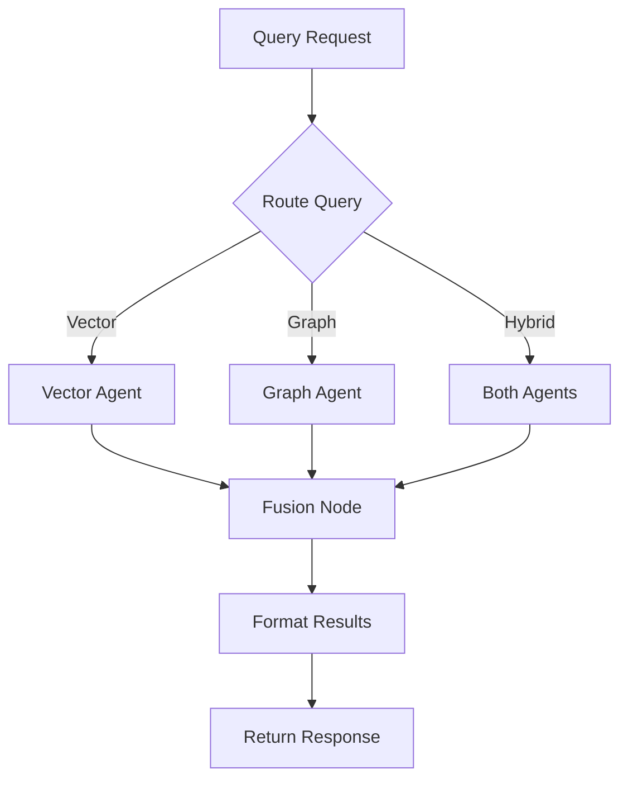

# Architecture Deep Dive

## System Overview

KineticGraph-Vectra implements a **Hybrid Retrieval-Augmented Generation (RAG)** pattern that combines the strengths of two complementary database paradigms:

### Design Philosophy

1. **Vector Search (ChromaDB):** Excels at semantic similarity and finding conceptually related content
2. **Graph Search (Neo4j):** Excels at understanding relationships and traversing connected entities
3. **Reciprocal Rank Fusion:** Intelligently merges results from both sources

---

## Component Architecture

### 1. API Layer (FastAPI)

**Location:** `/app`

```
FastAPI Application
├── Entry Point (main.py)
├── Pydantic Models (models.py)
└── Route Handlers
    ├── Health Check
    ├── Document Ingestion
    └── Query Processing
```

**Key Features:**
- Async/await for high concurrency
- Automatic OpenAPI documentation
- Pydantic validation
- CORS middleware
- Health probes for Kubernetes

**Scaling Strategy:**
- Horizontal scaling with K8s HPA
- Stateless design
- Connection pooling to databases

---

### 2. Orchestration Layer (LangGraph)

**Location:** `/core/langgraph_workflow.py`



**Vector Agent:**
- Generates embeddings using OpenAI
- Performs similarity search in ChromaDB
- Returns ranked results with distance scores

**Graph Agent:**
- Converts natural language to Cypher queries using LLM
- Executes graph traversals in Neo4j
- Returns structured relationship data

**Fusion Node:**
- Implements Reciprocal Rank Fusion (RRF)
- Deduplicates results
- Re-ranks combined results

**RRF Formula:**
```
RRF_score(d) = Σ 1/(k + rank_i(d))
```
Where:
- `d` = document
- `k` = constant (default: 60)
- `rank_i(d)` = rank of document in result set i

---

### 3. Database Services

#### ChromaDB Service

**Location:** `/services/chroma_service.py`

```python
ChromaService
├── Collection Management
├── Document Ingestion
│   ├── Embed text with OpenAI
│   └── Store vectors + metadata
└── Similarity Search
    ├── Generate query embedding
    ├── Vector similarity (cosine/L2)
    └── Filter by metadata
```

**Configuration:**
- Client-server mode (HTTP)
- Persistent storage
- Collection-based organization

#### Neo4j Service

**Location:** `/services/neo4j_service.py`

```python
Neo4jService
├── Connection Management
├── Graph Ingestion
│   ├── Create Document nodes
│   ├── Create Entity nodes
│   └── Create Relationships
└── Query Execution
    ├── NL → Cypher conversion
    ├── Graph traversal
    └── Result formatting
```

**Schema:**
```cypher
// Nodes
(Document {id, content, metadata})
(Entity {name, type})

// Relationships
(Document)-[:MENTIONS]->(Entity)
(Entity)-[:RELATES_TO {type}]->(Entity)
```

---

### 4. Worker Layer (Celery)

**Location:** `/workers`

```
Celery Workers
├── Task Queue (Redis)
├── Document Processor
│   ├── PDF Text Extraction
│   ├── Text Chunking
│   ├── Entity Extraction (LLM)
│   └── Relationship Extraction (LLM)
└── Database Population
    ├── Embed & Store in ChromaDB
    └── Graph Creation in Neo4j
```

**Processing Pipeline:**

```
PDF Upload
    ↓
Extract Text (PyPDF)
    ↓
Chunk Text (1000 chars, 200 overlap)
    ↓
Branch: Vector Path         Branch: Graph Path
    ↓                            ↓
Generate Embeddings         Extract Entities (GPT-4)
    ↓                            ↓
Store in ChromaDB           Extract Relationships
                                 ↓
                            Store in Neo4j
```

**Worker Configuration:**
- Concurrent task execution
- Automatic retries
- Progress tracking
- Graceful task termination

---

## Data Flow

### Ingestion Flow

```
1. User uploads PDF → FastAPI endpoint
2. File saved temporarily → Task queued in Redis
3. Celery worker picks up task
4. Worker extracts text from PDF
5. Worker chunks text into semantic segments
6. Parallel processing:
   a. Generate embeddings → Store in ChromaDB
   b. Extract entities/relationships → Store in Neo4j
7. Task marked as complete
8. Temporary file deleted
```

### Query Flow

```
1. User sends query → FastAPI endpoint
2. Query routed to LangGraph workflow
3. Based on mode:
   - Vector: ChromaDB search only
   - Graph: Neo4j search only
   - Hybrid: Both searches executed
4. Results passed to Fusion Node
5. RRF combines and ranks results
6. Results deduplicated and formatted
7. Response returned to user
```

---

## Scaling Architecture

### Horizontal Scaling

**API Pods:**
- Stateless design
- Auto-scale based on CPU/memory
- Load balanced with K8s Service

**Worker Pods:**
- Independent scaling from API
- Scale based on queue depth
- HPA configuration for demand

### Vertical Scaling

**Database Resources:**
- ChromaDB: Increase memory for larger vector indices
- Neo4j: Increase memory for graph traversal
- Redis: Typically lightweight, minimal scaling needed

### Resource Allocation

```yaml
# Recommended K8s resource limits
API:
  requests: {memory: 512Mi, cpu: 500m}
  limits: {memory: 1Gi, cpu: 1000m}

Worker:
  requests: {memory: 1Gi, cpu: 1000m}
  limits: {memory: 2Gi, cpu: 2000m}

ChromaDB:
  requests: {memory: 1Gi, cpu: 500m}
  limits: {memory: 2Gi, cpu: 1000m}

Neo4j:
  requests: {memory: 2Gi, cpu: 1000m}
  limits: {memory: 4Gi, cpu: 2000m}
```

---

## Performance Considerations

### Latency Targets

- **Health Check:** < 100ms
- **Vector Search:** < 500ms
- **Graph Search:** < 1000ms
- **Hybrid Search:** < 1500ms
- **Document Processing:** 5-30 seconds (async)

### Optimization Strategies

1. **Embedding Cache:** Cache frequently used query embeddings
2. **Connection Pooling:** Reuse database connections
3. **Batch Processing:** Process multiple chunks together
4. **Index Optimization:** Proper Neo4j indexes on Entity.name
5. **Result Caching:** Cache popular queries (Redis)

### Bottlenecks

Common bottlenecks and solutions:

| Bottleneck | Solution |
|------------|----------|
| OpenAI API rate limits | Implement exponential backoff, use Azure OpenAI |
| ChromaDB memory | Increase pod memory, implement sharding |
| Neo4j query performance | Add indexes, optimize Cypher queries |
| Worker queue buildup | Scale worker pods, increase concurrency |

---

## Security Architecture

### Authentication & Authorization

**Current State:** No authentication (development)

**Production Requirements:**

1. **API Authentication:**
   ```python
   # JWT middleware
   from fastapi import Depends, HTTPException
   from fastapi.security import HTTPBearer
   
   security = HTTPBearer()
   
   async def verify_token(credentials = Depends(security)):
       # Verify JWT token
       pass
   ```

2. **Database Security:**
   - Neo4j: Change default password
   - Use K8s secrets for credentials
   - TLS for all connections

3. **Network Policies:**
   ```yaml
   # K8s NetworkPolicy example
   apiVersion: networking.k8s.io/v1
   kind: NetworkPolicy
   metadata:
     name: api-policy
   spec:
     podSelector:
       matchLabels:
         app: kinetic-api
     ingress:
     - from:
       - podSelector:
           matchLabels:
             app: ingress-nginx
   ```

---

## Monitoring & Observability

### Metrics to Track

1. **Application Metrics:**
   - Request rate (requests/sec)
   - Response time (p50, p95, p99)
   - Error rate (%)
   - Active connections

2. **Database Metrics:**
   - ChromaDB: Collection size, query latency
   - Neo4j: Node count, query execution time
   - Redis: Queue depth, memory usage

3. **Worker Metrics:**
   - Tasks processed/sec
   - Task success/failure rate
   - Average task duration
   - Active workers

### Logging Strategy

**Structured Logging:**
```python
import logging
from pythonjsonlogger import jsonlogger

logger = logging.getLogger()
handler = logging.StreamHandler()
formatter = jsonlogger.JsonFormatter()
handler.setFormatter(formatter)
logger.addHandler(handler)

logger.info("Query executed", extra={
    "query": query,
    "mode": mode,
    "execution_time_ms": 234.56,
    "results_count": 10
})
```

**Log Aggregation:**
- Use ELK stack (Elasticsearch, Logstash, Kibana)
- Or Loki + Grafana for K8s
- CloudWatch for AWS deployments

---

## Disaster Recovery

### Backup Strategy

1. **ChromaDB:**
   - Backup persistent volume
   - Export collection data periodically

2. **Neo4j:**
   - Automated backups with neo4j-admin
   - Point-in-time recovery
   - Backup to S3/GCS

3. **Redis:**
   - RDB snapshots
   - AOF persistence for critical data

### Recovery Procedures

```bash
# ChromaDB recovery
kubectl restore pvc chroma-pvc from-snapshot snapshot-xyz

# Neo4j recovery
neo4j-admin restore --from=/backup/neo4j-backup-2026-02-05

# Redis recovery
redis-cli --rdb /backup/redis-dump.rdb
```

---

## Future Architecture Enhancements

### Short-term (3-6 months)

1. **Caching Layer:** Redis cache for popular queries
2. **Enhanced Entity Extraction:** Use spaCy + GPT-4 hybrid
3. **Query Analytics:** Track and optimize slow queries
4. **Multi-tenant Support:** Isolate data per tenant

### Long-term (6-12 months)

1. **Multi-modal Support:** Process images, tables, charts
2. **Distributed ChromaDB:** Sharding for massive scale
3. **Neo4j Causal Cluster:** High availability setup
4. **Real-time Streaming:** WebSocket for progressive results
5. **Advanced RAG:** Query rewriting, sub-question decomposition
6. **Federated Learning:** Privacy-preserving embeddings

---

## Technology Alternatives

### Database Alternatives

| Component | Current | Alternatives |
|-----------|---------|--------------|
| Vector DB | ChromaDB | Pinecone, Weaviate, Milvus, Qdrant |
| Graph DB | Neo4j | ArangoDB, JanusGraph, Amazon Neptune |
| Task Queue | Celery+Redis | RabbitMQ, AWS SQS, Google Cloud Tasks |

### Framework Alternatives

| Component | Current | Alternatives |
|-----------|---------|--------------|
| API | FastAPI | Flask, Django, Express.js |
| Orchestration | LangGraph | LangChain, Haystack, custom workflows |
| Workers | Celery | Dramatiq, Huey, Apache Airflow |

---

## Conclusion

KineticGraph-Vectra's architecture is designed for:

- **Scalability:** Horizontal scaling at every layer
- **Reliability:** Health checks, retries, graceful degradation
- **Performance:** Async operations, connection pooling
- **Maintainability:** Clean separation of concerns
- **Extensibility:** Pluggable components, clear interfaces

The system can scale from a laptop (Docker Compose) to enterprise production (Kubernetes) without architectural changes.

---

For implementation details, see:
- [README.md](README.md) - Setup and usage
- [API.md](API.md) - API documentation
- [QUICKSTART.md](QUICKSTART.md) - Quick start guide
