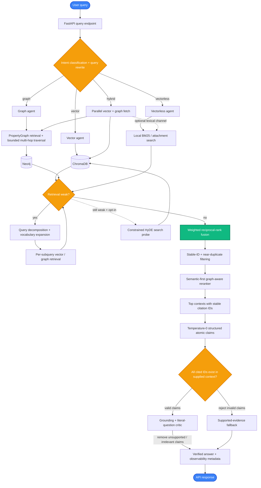
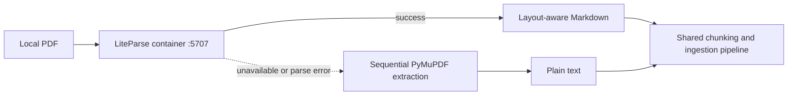

# KineticGraph-Vectra

<div align="center">

**A Production-Ready Hybrid RAG System**

*Combining Vector Search (ChromaDB) and Graph Reasoning (Neo4j) with LangGraph Orchestration*

[](https://fastapi.tiangolo.com)
[](https://www.python.org)
[](https://www.docker.com)
[](https://docs.ragas.io)

</div>

---

## 🎯 Overview

**KineticGraph-Vectra** is a lean, highly optimized hybrid RAG (Retrieval-Augmented Generation) system that coordinates searches across:

- **Vector Database (ChromaDB):** Fast semantic similarity search on document embeddings.
- **Graph Database (Neo4j):** Deep relational reasoning with entities and relationships.
- **Vectorless Search (BM25 Local Cache):** Ultra-fast lexical retrieval directly from disk.
- **Fusion Layer (RRF):** Reciprocal Rank Fusion to intelligently merge results from all active retrieval pathways.

The system uses **LangGraph** to orchestrate complex query workflows and **Celery** for asynchronous document processing.

Development is guided by the evidence-first [Kinegraph Architecture Principles](docs/ARCHITECTURE_PRINCIPLES.md), including explicit product vision, measurable goals, and a decision gate for new retrieval features.

---

## ✨ Codebase Highlights & Optimization

### 1. Kinetic-V v3 Context-Enriched Graph Nodes

Kinetic-V v3 closes a key grounding gap in the graph retrieval path: entity results now carry the source chunks needed to support and cite their claims. The additive v2 → v3 migration enriches existing Neo4j entities with:

- A concise `description` generated from existing graph evidence.
- Stable `parent_context_chunk_ids` linking graph entities to their source chunks.
- A compact JSON evidence snapshot for retrieval-time grounding while ChromaDB remains the authoritative store for embeddings and full vector content.
- Relationship evidence and graph-positioning fields (`community_id`, `centrality_score`, and `depth_from_root`).
- A `schema_version` marker so migrated nodes can be audited safely.

Neo4j cannot store nested maps as native properties, so context links and relationship evidence are serialized while stable chunk IDs remain directly queryable. Graph retrieval expands these persisted evidence chunks into the generation context with chunk IDs such as `[chunk_id]`, making answers easier to ground and cite.

The migration is additive and idempotent: it updates entities with existing `MENTIONS` links, reports entities without source context, and does not delete or re-embed data. See [`docs/v3_schema_audit.md`](docs/v3_schema_audit.md) for the schema-gap audit and design rationale.

### 2. Robust RAGAS Evaluation & Diagnostics
- **Live Failure Interception**: [`RAGASEvaluator`](eval/ragas_evaluator.py) records evaluation failures and may compute keyword heuristics for diagnostics, but the benchmark gate rejects any row with `ragas_failed=True`. Fallback scores cannot be reported as RAGAS.
- **Concurrent Batch Eval**: Added `evaluate_live_workflow` and `evaluate_live_single` supporting concurrent, rate-limited live workflow evaluations asynchronously, resulting in faster and safer benchmark runs.
- **Model-Agnostic Critic Settings**: Configures separate evaluation LLMs (critic/judge) via the `critic_model` parameter, enabling stable benchmark tracking (e.g., using Claude Haiku) even while testing various generation engines.
- **OpenRouter Compatibility**: Detects OpenRouter environments and automatically configures base URLs accordingly, enabling direct usage of stable and extremely cheap paid OpenRouter endpoints (e.g., `gpt-4o-mini` or `meta-llama/llama-3.3-70b-instruct`) without hitting free-tier congestion or 429 rate-limiting.

### 3. "Ponytail" YAGNI Optimization
- **Purged Over-Engineering**: Cleaned up the repository by deleting speculative Kubernetes manifests, custom telemetry databases, Streamlit dashboard instances, and LangSmith tracing wrappers.
- **Pruned Dependencies & Vulnerabilities**: Removed unused heavy libraries (`streamlit`, `plotly`, `langsmith`, `psycopg2-binary`) from `requirements.txt` to minimize codebase bloat, dependency conflicts, and security vulnerability surface areas.
- **Ingestion Streamlining**: Replaced Celery's billiard-based parallel PDF text extraction pool with a fast, sequential PyMuPDF (fitz) iteration loop inside `document_processor.py`, eliminating process-forking overhead and file-locking bottlenecks.

### 4. Decoupled PropertyGraphIndex Dual-Store (Neo4j + ChromaDB)
KineticGraph-Vectra features a **state-of-the-art decoupled Graph RAG index** using LlamaIndex's `PropertyGraphIndex` but uniquely engineered to maintain **strict storage isolation** between the relational graph database (**Neo4j**) and the dense vector database (**ChromaDB**). 

Unlike default implementations that collapse both vectors and graph entities into Neo4j's native vector indices, this decoupled architecture guarantees:
- **Independent Scaling**: Scale your vector query capacity (ChromaDB memory/nodes) independently from your graph traversal complexity (Neo4j memory/CPU).
- **Vendor Lock-in Avoidance**: Swap out ChromaDB or Neo4j for other specialized engines without rebuilding the entire extraction or ingestion pipelines.
- **Granular Embedding Fusing**: Compute and store embeddings for chunks, entities, and relationship summaries, enabling precise Reciprocal Rank Fusion (RRF) at query time.

#### Ingestion Flow & Extractor Stack
Every ingested document goes through a pipeline of concurrent, specialized extractors aligned with a constrained ontology schema:

```mermaid
flowchart LR
    Doc["PDF, Markdown, or text"] --> Parse{"PDF?"}
    Parse -->|"yes"| LiteParse["LiteParse: layout-aware Markdown"]
    LiteParse -.->|"unavailable or failed"| PyMuPDF["PyMuPDF fallback"]
    Parse -->|"no"| SourceText["Source text"]
    LiteParse --> Chunking["Recursive chunking + SHA-256 content hashes"]
    PyMuPDF --> Chunking
    SourceText --> Chunking
    Chunking --> Idempotency{"Chunk already in Neo4j?"}
    Idempotency -->|"yes"| Skip["Skip duplicate"]
    Idempotency -->|"no"| Extractors["Schema + tagged + resolution + implicit-path extractors"]
    Extractors --> PGI["LlamaIndex PropertyGraphIndex"]
    PGI --> GraphStore[("Neo4j graph + MENTIONS links")]
    PGI --> VectorStore[("ChromaDB embeddings")]
    GraphStore --> Enricher["NodeEnricher for touched entities"]
    VectorStore --> Verify["Exact-ID / provenance verification"]
    Verify --> Enricher
    Enricher -->|"verified context IDs, descriptions, relationship evidence, positioning"| GraphStore
    Enricher --> Audit["Complete / incomplete enrichment report"]
```



1. **`SchemaLLMPathExtractor`**: Constrains extraction to a strict YAML-defined ontology (e.g., `Component`, `Service`, `Command`, `Status`) and relations (e.g., `Uses`, `Implements`, `Minimizes`).
2. **`TaggedSimpleLLMPathExtractor`**: Serves as a high-recall fallback extractor to capture open-domain facts when schema constraints are too narrow.
3. **`EntityResolutionExtractor`**: Runs inline semantic deduplication (using exact token match and high-similarity Levenshtein/Rau-de-Smet clustering) to collapse alias nodes (e.g. `LangGraph` and `LangGraph orchestrator`) before write time.
4. **`ImplicitPathExtractor`**: Injects structural knowledge paths (e.g., `Chunk` nodes linked via `MENTIONS` to their extracted entities) to preserve local source context.

### 5. Configurable Multi-Hop Graph Traversal

Graph and hybrid queries can expand from matched entities across one to five relationship hops. The default is a bounded three-hop breadth-first traversal; depth-first and community-restricted traversal are also available. Every traversal result includes `relationship_path`, `traversal_depth`, `traversal_strategy`, `max_hops`, `seed_node_id`, and `community_id` metadata, together with directional relationship evidence.

```json
{
  "query": "How are LangGraph, Neo4j, and RRF connected?",
  "mode": "graph",
  "max_results": 10,
  "max_hops": 3,
  "traversal_strategy": "bfs",
  "community_id": null
}
```

Use `"dfs"` to prioritize deep paths or `"community"` to restrict expansion to the seed entity's computed community. Traversal rejects cycles and enforces a maximum of five hops.

### 6. Semantic-First Graph-Aware Reranking

After RRF, candidates pass through a relevance gate based on the original user query. Surviving graph results receive bounded secondary signals from node centrality, community support, relationship weight, and traversal distance. Semantic relevance retains 70% of the configured weight, so a highly connected but irrelevant node cannot displace directly relevant evidence.

The precision path retrieves a wide per-channel candidate pool (25 by default), applies RRF, removes near-identical chunks at cosine similarity ≥ 0.95, reranks the survivors, and sends at most 6 contexts to generation. The graph traversal default is two hops, while one to five hops remain request-configurable for evaluation.

The reranker preserves `score`, `rrf_score`, `original_score`, and source provenance. It adds `semantic_score`, `graph_signal_score`, `rerank_score`, `rerank_components`, and `rerank_mode` for observability. Cross-encoder scoring is enabled by default in the normal workflow; the model and relevance floor are configured through `RERANKER_MODEL` and `RERANKER_MIN_RELEVANCE`. `cross-encoder/ms-marco-MiniLM-L-6-v2` remains the lightweight default; `BAAI/bge-reranker-v2-m3` can be selected for a stronger multilingual reranker. If the optional model is unavailable, Kinegraph logs the fallback and reports `graph_aware_keyword` mode.

### 7. Conditional Query Recovery Before RRF

Kinegraph evaluates ordinary vector and graph retrieval before fusion. Recovery runs only when observable signals indicate weak results, such as too few candidates, low top score, no graph seed/path, or low source diversity.

The recovery order is deliberately conservative:

```text
Normal retrieval
    → weakness assessment
    → query decomposition + subquery execution
    → structured vocabulary expansion (vector only)
    → reassessment
    → optional constrained HyDE (vector only)
    → subquery-result fusion
    → cross-channel RRF
```

The original query remains authoritative for final reranking. Generated vocabulary never becomes graph seed input. A HyDE hypothesis is an opt-in search probe (`enable_hyde_fallback: true`), is never added to answer context, and is explicitly marked `hypothesis_is_evidence: false`. Recovery metadata reports its trigger reasons, subqueries, vocabulary, hypothesis usage, assessments, and latency.

```json
{
  "query": "How do Neo4j and ChromaDB work together?",
  "mode": "hybrid",
  "enable_conditional_recovery": true,
  "enable_hyde_fallback": false
}
```

### 8. Recall Controls and Schema Coverage

Weak compound and multi-hop queries are decomposed before RRF. Each validated subquery retrieves independently from the active vector and graph channels, then per-channel results are fused before cross-channel fusion. Strong initial retrieval skips decomposition, preserving the evidence-first recovery gate.

Hybrid RRF weights are request-tunable and expose per-result `rrf_contributions`. Vector and graph remain equally weighted by default. Local BM25 participation is opt-in so lexical expansion can be measured without silently changing normal hybrid behavior.

```json
{
  "query": "How do graph traversal and vector retrieval contribute to Kinegraph?",
  "mode": "hybrid",
  "vector_fusion_weight": 1.0,
  "graph_fusion_weight": 1.2,
  "enable_lexical_fusion": true,
  "lexical_fusion_weight": 0.6
}
```

Audit strict ontology coverage, recurring fallback relation types, and golden questions without graph entity mentions using:

```bash
PYTHONPATH=. python scripts/audit_schema_coverage.py
```

The audit is diagnostic rather than an automatic schema mutation. Entity-mention coverage is not a RAGAS score; repeated fallback types and uncovered golden questions must be reviewed before expanding `config/ontology_schema.yaml`.

### 9. Citation-Constrained Generation and Grounding Critique

The synthesis node now returns atomic claims as structured JSON, with every claim carrying one or more exact IDs from the reranked context. Chroma result IDs and graph node IDs are preserved through retrieval; a deterministic validator rejects claims with missing or unknown citations before any answer text is returned. Accepted claims are rendered with their verified IDs, such as `[vec_0452]`.

A separate temperature-0 critic then checks each accepted claim against only its cited chunk text and the literal user question. A claim survives only when it is both grounded and directly answers the question (or an explicit component of a compound question); grounded background and broad context summaries are removed. The critic may retain or remove existing claims, but cannot rewrite them, add facts, or introduce citations. If the critic is unavailable, Kinegraph visibly reports the failure and returns only the claims that passed deterministic citation validation. Set `enable_grounding_critique: false` only for controlled benchmark comparisons.

Both synthesis and critique default to temperature `0.0`. Configure them with `GENERATION_TEMPERATURE`, `FAITHFULNESS_CRITIC_MODEL`, and `FAITHFULNESS_CRITIC_TEMPERATURE`. API responses expose `citation_validation`, `grounding_critique`, `answer_relevancy`, and per-stage critique latency. Relevancy metadata distinguishes unsupported claims from supported-but-irrelevant claims and reports complete, partial, or missing question coverage.

```json
{
  "query": "How are Neo4j and ChromaDB connected?",
  "mode": "hybrid",
  "enable_grounding_critique": true
}
```

---

## 🏗️ Architecture

### System Components



### Infrastructure Stack

| Component | Technology | Purpose |
|-----------|------------|---------|
| **API Framework** | FastAPI | Asynchronous REST API |
| **Orchestration** | LangGraph | Intent routing, parallel retrieval, rerank, generate |
| **Vector DB** | ChromaDB | Semantic search |
| **Graph DB** | Neo4j | Entity relationships |
| **Task Queue** | Celery + Redis | Async document processing |
| **Document Parser** | LiteParse (self-hosted) | Layout-aware PDF → Markdown (tables, multi-column) |
| **Containerization** | Docker Compose | Local deployment and testing |
| **Evaluation** | RAGAS | Offline/live evaluation (faithfulness, relevancy, recall, correctness) |

### 📄 LiteParse — Local Document Parsing Service

KineticGraph-Vectra uses a **self-hosted [LiteParse](https://github.com/run-llama/liteparse-server) container** as its primary PDF extraction engine. Unlike traditional text-extraction libraries (PyMuPDF, pypdf) that flatten multi-column layouts and drop table formatting, LiteParse uses PDFium coordinate-aware layout analysis and embedded OCR to produce clean, structure-preserving **Markdown**.

**Why this matters for GraphRAG:**
- **Table Context Isolation:** Tables output as `| Entity | Relation | Entity |` syntax — column values map directly to their header semantic bounds during entity extraction.
- **Multi-column Rectification:** Absolute bounding-box tracing prevents unrelated paragraphs from being joined across columns.
- **Zero Data Egress:** Processing runs entirely within the local Docker network — no cloud API calls, no per-page costs.

**Resilient Fallback:** If the LiteParse container is unavailable, `extract_text_from_pdf` silently falls back to PyMuPDF and logs a warning — ingestion never hard-fails due to parser availability.



**Key files:**
- [`backend/graph_ingestion/lite_parser.py`](backend/graph_ingestion/lite_parser.py) — `LiteParseClient` HTTP wrapper
- [`backend/workers/document_processor.py`](backend/workers/document_processor.py) — `extract_text_from_pdf` with LiteParse-first strategy
- [`infra/docker-compose.yml`](infra/docker-compose.yml) — `liteparse` service definition

---

## 🚀 Quick Start

### Prerequisites

- **Docker** and **Docker Compose**
- **OpenAI API Key**

### 1. Clone and Setup

```bash
# Clone the repository and copy environment template
cp .env.example .env

# Edit .env and add your OpenAI API key
# PARSER_URL is pre-configured to http://liteparse:5707 inside Docker
# For local dev outside Docker, set PARSER_URL=http://localhost:5707
nano .env
```

### 2. Start Services

```bash
# Build and start all services via Docker Compose (resides in infra/)
cd infra
docker compose up --build -d
```

### 3. Verify Health

| Service | URL | Notes |
|---------|-----|-------|
| **Swagger UI** | http://localhost:8000/docs | FastAPI API docs |
| **Neo4j Browser** | http://localhost:7474 | user: `neo4j`, password: see `.env` |
| **ChromaDB API** | http://localhost:8001 | Heartbeat: `/api/v1/heartbeat` |
| **LiteParse** | http://localhost:5707 | Liveness: `POST /parse` → `400` = alive |
| **Chat UI** | http://localhost:8080 | Start via `cd frontend && python3 serve.py` |

```bash
# Quick LiteParse liveness check
curl -s -o /dev/null -w "LiteParse: %{http_code}\n" -X POST http://localhost:5707/parse
# Expected: LiteParse: 400
```

### 4. Enrich Existing Graph Nodes for v3

After upgrading an existing v2 deployment, preview the migration before applying it:

```bash
# Report migration candidates without changing Neo4j
PYTHONPATH=. python scripts/enrich_kinetic_v_nodes.py --dry-run --batch-size 200

# Apply the additive v3 enrichment
PYTHONPATH=. python scripts/enrich_kinetic_v_nodes.py
```

Example result:

```text
{'enriched': 128, 'skipped_without_verified_context': 7, 'scanned': 135, 'verified_vector_links': 384, 'missing_vector_links': 7, 'complete': False}
```

New ingestion remains idempotent across both `Chunk` and legacy `__Chunk__` Neo4j labels and runs enrichment automatically. Links missing from ChromaDB—or present without an embedding—are rejected and counted. Existing entities without verified source chunks are deliberately skipped so the migration never invents supporting evidence.

---

## 📚 Usage

### Document Ingestion

```bash
curl -X POST "http://localhost:8000/api/v1/ingest/document" \
  -H "Content-Type: multipart/form-data" \
  -F "file=@/path/to/document.pdf"
```

### Querying the System (Hybrid Search)

```bash
curl -X POST "http://localhost:8000/api/v1/query" \
  -H "Content-Type: application/json" \
  -d '{
    "query": "What are the main findings about Reciprocal Rank Fusion?",
    "mode": "hybrid",
    "max_results": 5
  }'
```

---

## 🔬 Evaluation & Diagnostics

The evaluation layer is built around [RAGAS](https://docs.ragas.io) to monitor system performance offline and live. The checked-in benchmark is [`eval/kinegraph_benchmark_v1.csv`](eval/kinegraph_benchmark_v1.csv); it currently has **5 queries** with the generated schema `user_input`, `reference_contexts`, `reference`, `persona_name`, `query_style`, `query_length`, and `synthesizer_name`.

- **Synthetic Testset Generation**: Create rich multi-hop and specific factual benchmark questions directly from the project's documentation using:
  ```bash
  PYTHONPATH=. python scripts/generate_testset.py --size 20 --output eval/kinegraph_benchmark_v1.csv
  ```
- **Direct Database Ingestion**: Populate ChromaDB and Neo4j locally with documentation:
  ```bash
  PYTHONPATH=. python scripts/ingest_docs.py
  ```
- **Live Pipeline Benchmarking**: Execute the live RAG pipeline on the checked-in benchmark questions and compute RAGAS metrics:
  ```bash
  PYTHONPATH=. python eval/ragas_evaluator.py --max-hops 2 --max-results 6 --candidate-pool-size 25
  ```
- **Hop-depth precision experiment**: Persist separate accepted runs for direct comparison:
  ```bash
  PYTHONPATH=. python eval/ragas_evaluator.py --max-hops 1 --max-results 6 --candidate-pool-size 25 --run-label hop1
  PYTHONPATH=. python eval/ragas_evaluator.py --max-hops 2 --max-results 6 --candidate-pool-size 25 --run-label hop2
  ```
- **Fusion recall experiment**: Sweep weights while preserving separate accepted outputs:
  ```bash
  PYTHONPATH=. python eval/ragas_evaluator.py --vector-weight 1.0 --graph-weight 1.2 --run-label graph12
  PYTHONPATH=. python eval/ragas_evaluator.py --enable-lexical-fusion --vector-weight 1.0 --graph-weight 1.0 --lexical-weight 0.6 --run-label lexical06
  ```
- **Live Diagnostics**: Single-query and concurrent live execution are implemented by `evaluate_live_single` and `evaluate_live_workflow`. The CLI loads the real CSV and executes `HybridRAGWorkflow`; it does not depend on nonexistent `src/`, `benchmarks/`, or `scratch/run_evaluation.py` paths.
- **Acceptance Gate**: Diagnostic keyword fallbacks remain available, but the CLI exits with status `2` and refuses to update the report or chart when any result has `ragas_failed=True`.
- **Controlled Experiment Gate**: Accepted runs record the dataset SHA-256, Git revision, complete retrieval configuration, generation and judge models, and a weighted composite with a deterministic 95% bootstrap interval. An optional baseline manifest enforces one changed lever, a ±0.01 tie tolerance, and a maximum 0.05 regression for any individual metric. See [Controlled Benchmark Experiments](docs/EXPERIMENT_VALIDATION.md).
- **Result Contract**: Evaluation consumes the workflow's `answer` and retrieved `chunks`. Fields such as `max_hops_used`, `hyde_generated`, and `retrieved_nodes` are not top-level evaluator results. Traversal and recovery diagnostics live in chunk metadata or `recovery_details` and require a separate retrieval-path audit.

### Benchmark Status

The latest persisted RAGAS report predates the v3 implementation. There is currently **no accepted post-v3 result proving improvement**. The table therefore compares the two recorded pre-v3 series with the complete v3 target set; it must not be read as a v3 evaluation.

| Metric | Recorded baseline | Recorded composed | v3 target | Composed vs target |
| :--- | :---: | :---: | :---: | :---: |
| **Faithfulness** | 0.3292 | 0.6000 | ≥ 0.75 | **Fail** |
| **Answer Relevancy** | 0.1016 | 0.5659 | ≥ 0.65 | **Fail** |
| **Context Precision** | 1.0000 | 0.4500 | ≥ 0.90 | **Fail** |
| **Context Recall** | 0.3476 | 0.6000 | ≥ 0.65 | **Fail** |
| **Answer Correctness** | 0.3745 | 0.4082 | ≥ 0.60 | **Fail** |

Recorded overall composites are **0.4306 baseline** and **0.5248 composed**. A post-v3 run is accepted only when all 20 intended benchmark rows execute against the live hybrid workflow, every required metric is finite, no workflow error occurs, and every row explicitly reports `ragas_failed=False`.

#### Benchmark Spider Graph


The chart is reproducible with `PYTHONPATH=. python scripts/generate_benchmark_spider.py`. It visualizes persisted pre-v3 evidence and targets only; a future accepted post-v3 run may replace the recorded series.

---

## 🛠️ Local Development

```bash
# Create and activate virtual environment
python -m venv venv
source venv/bin/activate

# Install dependencies
pip install -r requirements.txt

# Run FastAPI app locally
uvicorn backend.app.main:app --reload --port 8000

# Run Celery worker
celery -A backend.workers.celery_app worker --loglevel=info

# Run the v3 enrichment and retrieval regression tests
PYTHONPATH=. pytest -q tests/test_enrichment.py tests/test_retrievers.py tests/test_ingest_idempotency.py tests/test_stores.py
```

---

**Built with ❤️ for lean, highly performant hybrid RAG systems**
