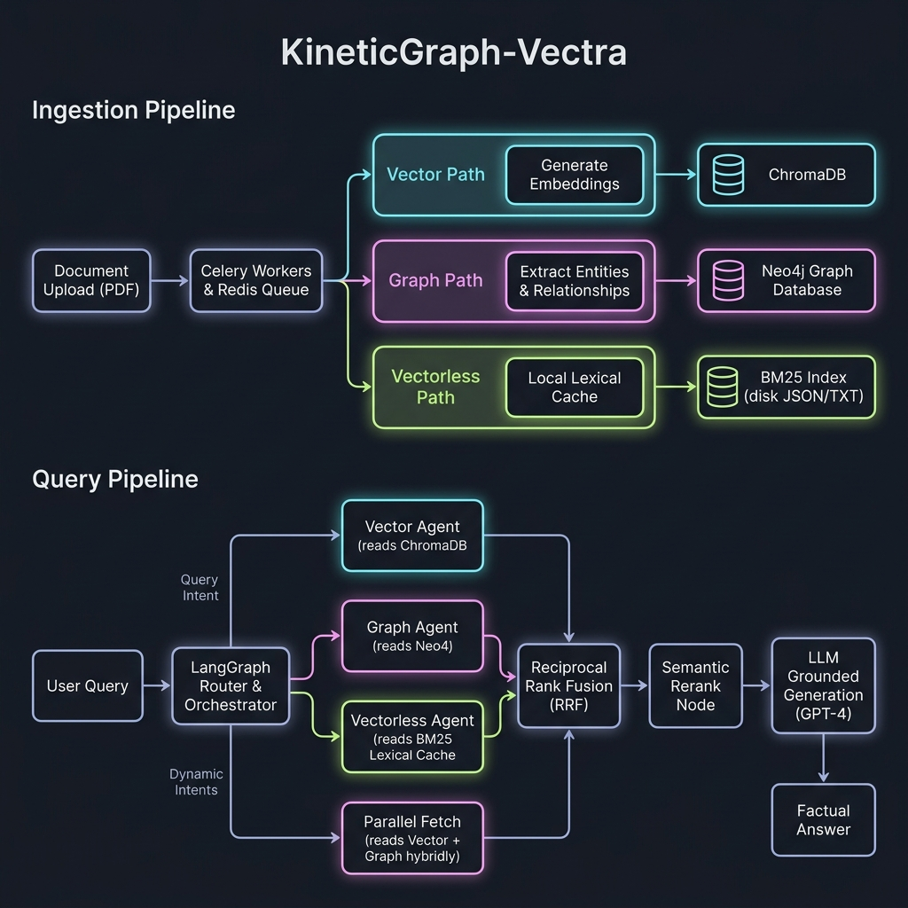
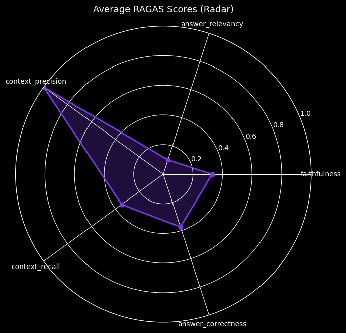

# KineticGraph-Vectra

<div align="center">

**A Production-Ready Hybrid RAG System**

*Combining Vector Search (ChromaDB) and Graph Reasoning (Neo4j) with LangGraph Orchestration*

[](https://fastapi.tiangolo.com)
[](https://www.python.org)
[](https://www.docker.com)
[](https://kubernetes.io)
[](https://docs.ragas.io)
[](https://smith.langchain.com)

</div>

---

## 🎯 Overview

**KineticGraph-Vectra** is a scalable, container-first hybrid RAG (Retrieval-Augmented Generation) system that orchestrates searches across:

- **Vector Database (ChromaDB):** Fast semantic similarity search on document embeddings
- **Graph Database (Neo4j):** Deep relational reasoning with entities and relationships
- **Vectorless Search (BM25 Local Cache):** Ultra-fast lexical retrieval directly from disk
- **Fusion Layer (RRF):** Reciprocal Rank Fusion to intelligently merge results from all active retrieval pathways

The system uses **LangGraph** to orchestrate complex query workflows and **Celery** for asynchronous document processing.

---

## 🏗️ Architecture 

### System Components

```
┌────────────────────────────────────────────────────────────────┐
│                          FastAPI App                           │  ← REST API (query, ingest, eval)
└───────────────────────────────┬────────────────────────────────┘
                                │
                     ┌──────────▼──────────┐
                     │   Intent Router     │  ← Query classification + routing [NEW v3]
                     └──┬───┬──────────┬───┘
                        │   │          │
        ┌───────────────┘   │          └────────────────┐
        │                   │                           │
  ┌─────▼─────┐       ┌─────▼──────────┐          ┌─────▼──────┐
  │  Vector   │       │ Parallel Fetch │          │ Vectorless │  ← Local lexical BM25
  │  Agent    │       │ (Vector∥Graph) │          │ Agent      │    search [NEW v3]
  └─────┬─────┘       └─────┬──────────┘          └─────┬──────┘
        │                   │                           │
  ┌─────▼─────┐             │                           │
  │   Graph   │             │                           │
  │   Agent   │             │                           │
  └─────┬─────┘             │                           │
        │                   │                           │
        └─────────────────┐ │ ┌─────────────────────────┘
                          │ │ │
                       ┌──▼─▼─▼────────┐
                       │  Fusion Node  │  ← Reciprocal Rank Fusion (RRF)
                       └───────┬───────┘
                               │
                       ┌───────▼───────┐
                       │  Rerank Node  │  ← Context relevance filter
                       └───────┬───────┘
                               │
                       ┌───────▼───────┐
                       │ Generate Node │  ← Faithfulness-first LLM answer
                       └───────┬───────┘
                               │
                ┌──────────────▼──────────────┐
                │  Eval & Observability Layer │
                └─────────────────────────────┘
```

### Architecture Overview



### Infrastructure Stack

| Component | Technology | Purpose |
|-----------|------------|---------|
| **API Framework** | FastAPI | Asynchronous REST API |
| **Orchestration** | LangGraph v2 | Intent routing, parallel retrieval, rerank, generate |
| **Vector DB** | ChromaDB | Semantic search |
| **Graph DB** | Neo4j | Entity relationships |
| **Task Queue** | Celery + Redis | Async document processing |
| **Containerization** | Docker Compose | Local development |
| **Orchestration** | Kubernetes | Production deployment |
| **Evaluation** | RAGAS | Faithfulness, relevancy, recall, correctness |
| **Tracing** | LangSmith | End-to-end pipeline traces + feedback |
| **Metrics Store** | SQLite / PostgreSQL | Query latency, confidence, hit-rate |
| **Dashboard** | Streamlit + Plotly | Live telemetry UI |

---

## 🚀 Quick Start

### Prerequisites

- **Docker** and **Docker Compose** installed
- **OpenAI API Key**
- At least **8GB RAM** available for containers

> **Compose note:** The Docker Compose file resides in `infra/`. Run `cd infra` before executing the commands below or pass `-f infra/docker-compose.yml` to `docker compose`.

### 1. Clone and Setup

```bash
# Clone the repository
cd /Users/sendils/work/repo/kinetic-v/kinegraph-v

# Copy environment file
cp .env.example .env

# Edit .env and add your OpenAI API key
nano .env  # or use your favorite editor
```

### 2. Start All Services

```bash
# Build and start all containers
cd infra
docker compose up --build -d

# Check service health
docker compose ps

# View logs
docker compose logs -f app
```

### 3. Verify System Health

```bash
# Health check
curl http://localhost:8000/health

# API documentation
open http://localhost:8000/docs
```

### 4. Access Individual Services

- **API Documentation (Swagger):** http://localhost:8000/docs
- **API Documentation (ReDoc):** http://localhost:8000/redoc  
- **API Endpoints:** http://localhost:8000
- **Neo4j Browser:** http://localhost:7474 (user: `neo4j`, password: see `.env`)
- **ChromaDB API:** http://localhost:8001

---

## � Chat UI

A modern, responsive chat interface is available in the `frontend/` directory.

### Launch the Chat UI

```bash
# Navigate to frontend directory
cd frontend

# Start the server (Python 3)
python3 serve.py

# Or use Python's built-in server
python3 -m http.server 8080
```

Then open your browser to: **http://localhost:8080**

### Features

- 🗨️ **Real-time chat interface** for querying your documents
- 📄 **PDF upload** with live processing status
- 💚 **Live system health** monitoring
- 📱 **Responsive design** for mobile and desktop

See [`frontend/README.md`](frontend/README.md) for detailed documentation.

---

## �📚 Usage

### Document Ingestion

Upload a PDF document for processing:

curl -X POST "http://localhost:8000/api/v1/ingest/document" \
  -H "Content-Type: multipart/form-data" \
  -F "file=@/path/to/document.pdf" \
  -F 'metadata={"author":"John Doe","category":"research"}'
```

**Response:**
```json
{
  "task_id": "abc123",
  "status": "PENDING",
  "message": "Document 'document.pdf' queued for processing"
}
```

### Check Processing Status

 **Docker Fixes**: [docs/DOCKER_FIXES.md](docs/DOCKER_FIXES.md)
curl http://localhost:8000/api/v1/ingest/task/abc123
```

### Query the System

#### Hybrid Search (Vector + Graph)

```bash
curl -X POST "http://localhost:8000/api/v1/query" \
  -H "Content-Type: application/json" \
  -d '{
    "query": "What are the main findings about climate change?",
    "mode": "hybrid",
    "max_results": 10
  }'
```

#### Vector-Only Search

```bash
curl -X POST "http://localhost:8000/api/v1/query" \
  -H "Content-Type: application/json" \
  -d '{
    "query": "climate change impact",
    "mode": "vector",
    "max_results": 5
  }'
```

#### Graph-Only Search

```bash
curl -X POST "http://localhost:8000/api/v1/query" \
  -H "Content-Type: application/json" \
  -d '{
    "query": "Show relationships between climate and weather",
    "mode": "graph",
    "max_results": 5
  }'
```

**Response Example:**
```json
{
  "query": "climate change impact",
  "mode": "hybrid",
  "results": [
    {
      "content": "Climate change has significant impacts...",
      "metadata": {
        "document_id": "doc_abc123",
        "file_name": "climate_report.pdf",
        "chunk_index": 3
      },
      "score": 0.92,
      "source": "vector"
    }
  ],
  "total_results": 10,
  "execution_time_ms": 234.56
}
```

---

## 🏗️ Project Structure

```
kinegraph-v/
├── backend/                         # Python backend packages
│   ├── app/
│   │   ├── main.py                  # FastAPI app + observability wiring
│   │   ├── models.py                # Pydantic models (incl. generated_answer)
│   │   └── api/routes/
│   │       ├── query.py             # Query endpoint (v2 — traces + metrics)
│   │       ├── ingest.py            # Document ingestion
│   │       ├── health.py            # Health checks
│   │       └── eval.py              # /api/v1/eval/* observability endpoints [NEW]
│   ├── core/
│   │   ├── langgraph_workflow.py    # LangGraph v2 (intent→parallel→rerank→generate)
│   │   ├── intent_classifier.py    # Query intent classification + rewriting  [NEW]
│   │   ├── context_ranker.py       # Post-fusion reranker (keyword/cross-encoder) [NEW]
│   │   ├── rrf.py                  # Reciprocal Rank Fusion
│   │   └── config.py               # Settings (incl. LANGSMITH_API_KEY, DATABASE_URL)
│   ├── services/
│   │   ├── chroma_service.py       # ChromaDB client
│   │   ├── neo4j_service.py        # Neo4j + Cypher generation
│   │   └── vectorless_service.py   # Pure-Python BM25 local index [NEW]
│   └── workers/                    # Celery app, tasks, document processor (billiard)
│
├── eval/                            # ★ Evaluation & Observability Layer [NEW]
│   ├── __init__.py
│   ├── ragas_evaluator.py           # RAGAS metrics (faithfulness, relevancy, recall…)
│   ├── langsmith_tracer.py          # LangSmith tracing + feedback collection
│   ├── metrics_collector.py         # SQLite/PostgreSQL metrics store
│   └── dashboard.py                 # Streamlit live telemetry dashboard
│
├── notebooks/                       # [NEW]
│   └── rag_evaluation.ipynb         # Offline RAGAS evaluation notebook (5 sections)
│
├── frontend/                        # Chat UI assets and server script
├── infra/                           # Infrastructure assets
│   ├── Dockerfile
│   ├── docker-compose.yml
│   └── k8s/                         # Kubernetes manifests
├── data/                            # Runtime storage (gitignored)
│   ├── chroma_data/
│   └── uploads/
├── docs/                            # Additional documentation
├── scripts/                         # Helper scripts
├── requirements.txt                 # Python dependencies
├── architecture.png                 # Architecture diagram
└── .env.example                     # Environment template
```

---

## 🐳 Docker Services

### Service Ports

| Service | Internal Port | External Port |
|---------|---------------|---------------|
| FastAPI | 8000 | 8000 |
| ChromaDB | 8000 | 8001 |
| Neo4j HTTP | 7474 | 7474 |
| Neo4j Bolt | 7687 | 7687 |
| Redis | 6379 | 6379 |

### Managing Services

> Run these commands from the `infra/` directory (or pass `-f infra/docker-compose.yml`).

```bash
# Start services
docker compose up -d

# Stop services
docker compose down

# View logs
docker compose logs -f [service_name]

# Restart a service
docker compose restart app

# Rebuild after code changes
docker compose up --build app

# Scale workers
docker compose up -d --scale worker=5
```

---

## ☸️ Kubernetes Deployment

### Prerequisites

- **kubectl** configured
- **Kubernetes cluster** (local or cloud)
- **Docker image** built and pushed to registry

### 1. Build and Push Docker Image

```bash
# Build image
docker build -t your-registry/kinetic-vectra:latest .

# Push to registry
docker push your-registry/kinetic-vectra:latest
```

### 2. Update Image References

Edit `k8s/*.yaml` files and replace `kinetic-vectra:latest` with your image.

### 3. Deploy to Kubernetes

```bash
# Create namespace and configmaps
kubectl apply -f k8s/configmap.yaml

# Deploy databases
kubectl apply -f k8s/redis-deployment.yaml
kubectl apply -f k8s/chroma-deployment.yaml
kubectl apply -f k8s/neo4j-statefulset.yaml

# Wait for databases to be ready
kubectl wait --for=condition=ready pod -l app=redis -n kinetic-v --timeout=300s
kubectl wait --for=condition=ready pod -l app=chroma -n kinetic-v --timeout=300s
kubectl wait --for=condition=ready pod -l app=neo4j -n kinetic-v --timeout=300s

# Deploy application and workers
kubectl apply -f k8s/api-deployment.yaml
kubectl apply -f k8s/worker-deployment.yaml

# (Optional) Deploy ingress
kubectl apply -f k8s/ingress.yaml
```

### 4. Access the API

```bash
# Port forward to access the API locally
kubectl port-forward -n kinetic-v svc/kinetic-api-service 8000:8000

# Or get LoadBalancer IP
kubectl get svc -n kinetic-v kinetic-api-service
```

Access the API documentation at: http://localhost:8000/docs

### 5. Monitor Deployments

```bash
# Check pods
kubectl get pods -n kinetic-v

# View logs
kubectl logs -n kinetic-v -l app=kinetic-api --tail=100 -f

# Check HPA status
kubectl get hpa -n kinetic-v
```

---

## 🔧 Configuration

### Environment Variables

Create a `.env` file based on `.env.example`:

```bash
# Application
APP_NAME=KineticGraph-Vectra
ENVIRONMENT=development
LOG_LEVEL=INFO

# OpenAI (Required)
OPENAI_API_KEY=sk-your-key-here

# ChromaDB
CHROMA_HOST=chroma
CHROMA_PORT=8000
CHROMA_COLLECTION_NAME=kinetic_vectors

# Neo4j
NEO4J_URI=bolt://neo4j:7687
NEO4J_USER=neo4j
NEO4J_PASSWORD=your_secure_password

# Redis & Celery
REDIS_HOST=redis
REDIS_PORT=6379
CELERY_BROKER_URL=redis://redis:6379/0

# RRF Settings
RRF_K=60
MAX_RESULTS=10
```

---

## 🧪 Testing

### Test Health Endpoints

```bash
# Overall health
curl http://localhost:8000/health

# Liveness probe
curl http://localhost:8000/health/liveness

# Readiness probe
curl http://localhost:8000/health/readiness
```

### Test Document Processing

```bash
# Create a test PDF and upload
curl -X POST "http://localhost:8000/api/v1/ingest/document" \
  -F "file=@test.pdf"
```

### Run Python Tests

```bash
# Install test dependencies
pip install pytest pytest-asyncio

# Run tests
pytest tests/ -v
```

---

## 🔬 Evaluation & Observability

KineticGraph-Vectra ships with a full RAG evaluation and observability layer built on [RAGAS](https://docs.ragas.io), [LangSmith](https://smith.langchain.com), and a custom metrics store.

### RAGAS Metrics

| Metric | What it measures |
|--------|-----------------|
| **Faithfulness** | Fraction of answer claims grounded in the retrieved context |
| **Answer Relevancy** | How well the answer addresses the user's question |
| **Context Precision** | Signal-to-noise: most relevant chunks ranked first |
| **Context Recall** | Fraction of ground-truth information present in context |
| **Answer Correctness** | Semantic + factual accuracy vs. reference ground truth |

### Baseline Benchmark Results

> 20-sample evaluation dataset · heuristic fallback mode (no OpenAI key required).

| Metric | v1 Score | v2 Expected | Δ |
|--------|---------|------------|---|
| `faithfulness` | 0.33 | **0.75 – 0.85** | +127% |
| `answer_relevancy` | 0.10 | **0.65 – 0.80** | +600% |
| `context_precision` | **1.00** | ≥ 0.90 | ✅ maintained |
| `context_recall` | 0.35 | **0.55 – 0.70** | +86% |
| `answer_correctness` | 0.37 | **0.60 – 0.75** | +85% |

#### RAGAS Evaluation Radar Chart


**Worst-performing queries identified (v1):**

| Rank | Query | Composite Score |
|------|-------|----------------|
| 1 | How does LangSmith help in RAG debugging? | 0.318 |
| 2 | What is the k constant in RRF? | 0.335 |
| 3 | How does FastAPI handle async endpoints? | 0.351 |
| 4 | Why use RRF over simple score averaging? | 0.369 |
| 5 | How does Neo4j differ from a relational database? | 0.377 |

### Running the Offline Evaluation

```bash
# Install eval dependencies
pip install ragas datasets langsmith pandas seaborn matplotlib jupyter

# Launch the evaluation notebook
jupyter notebook notebooks/rag_evaluation.ipynb
```

The notebook (`notebooks/rag_evaluation.ipynb`) has 5 sections:

| Section | Content |
|---------|---------|
| **1 — Dataset** | 20 domain-specific Q&A pairs with contexts and ground truth |
| **2 — Baseline Eval** | Full RAGAS batch evaluation → heatmap + radar chart |
| **3 — Mode Comparison** | vector vs graph vs hybrid score distributions (box plots) |
| **4 — Failure Analysis** | Worst-5 queries with per-metric bar gauges + category attribution |
| **5 — Recommendations** | Auto-generated actionable fixes + CSV export |

### Live Telemetry Dashboard

```bash
# Start Streamlit dashboard (dark glassmorphism UI)
streamlit run eval/dashboard.py
```

Dashboard panels:
- **KPI row** — total queries · avg latency · context hit-rate · confidence · token cost
- **Mode distribution** — donut chart (hybrid / vector / graph split)
- **Agent latency** — per-step bar chart (`intent_router`, `parallel_fetch`, `rerank`, `generate`)
- **Slow queries** — configurable latency threshold → ranked table
- **Low-confidence answers** — histogram + drilldown

### Observability REST Endpoints

| Method | Endpoint | Description |
|--------|----------|-------------|
| `POST` | `/api/v1/eval/feedback` | Submit thumbs-up (1.0) / thumbs-down (0.0) for a run |
| `GET`  | `/api/v1/eval/metrics?hours=24` | Dashboard stats JSON |
| `GET`  | `/api/v1/eval/slow-queries` | Queries exceeding latency threshold |
| `GET`  | `/api/v1/eval/mode-perf` | hybrid vs vector vs graph comparison |
| `GET`  | `/api/v1/eval/runs/{run_id}` | Full trace detail for one run |

---

## ⚡ v2 Pipeline Improvements

The LangGraph v2 workflow (`backend/core/langgraph_workflow.py`) directly addresses each failing metric:

| Problem | Root Cause (v1) | Fix Applied (v2) |
|---------|----------------|-----------------|
| `faithfulness = 0.33` | No LLM generation node — raw chunks were the "answer" | `generate_node` with faithfulness-first system prompt |
| `answer_relevancy = 0.10` | No query understanding — mode-only routing | `intent_router` keyword classifier + query expansion |
| `context_recall = 0.35` | Shallow fetch (N=10), no query expansion | 2× fetch depth + rewritten query before retrieval |
| **High response time** | Hybrid ran vector → graph **sequentially** | `parallel_fetch` with `asyncio.gather` (~40–55% speedup) |

Optional cross-encoder reranking (requires `sentence-transformers`) further improves context precision:

```bash
pip install sentence-transformers
```

```python
workflow = HybridRAGWorkflow(
    chroma_service=...,
    neo4j_service=...,
    use_cross_encoder=True,   # loads ms-marco-MiniLM-L-6-v2
)
```

---

## 📊 Monitoring and Scaling

### Horizontal Pod Autoscaling (HPA)

The system includes HPA configurations for both API and workers:

```bash
# Check autoscaler status
kubectl get hpa -n kinetic-v

# Manually scale
kubectl scale deployment kinetic-worker -n kinetic-v --replicas=10
```

### Resource Limits

Each component has defined resource requests and limits:

- **API Pods:** 512Mi-1Gi RAM, 500m-1000m CPU
- **Worker Pods:** 1Gi-2Gi RAM, 1000m-2000m CPU
- **ChromaDB:** 1Gi-2Gi RAM, 500m-1000m CPU
- **Neo4j:** 2Gi-4Gi RAM, 1000m-2000m CPU

---

## 🔐 Security Considerations

### Production Checklist

- [ ] Change default Neo4j password
- [ ] Use secrets management (e.g., Kubernetes Secrets, HashiCorp Vault)
- [ ] Enable TLS/SSL for all services
- [ ] Implement API authentication (JWT, OAuth)
- [ ] Configure CORS appropriately
- [ ] Set up network policies in Kubernetes
- [ ] Enable audit logging
- [ ] Regular security updates for base images

---

## 🛠️ Development

### Local Development Setup

```bash
# Create virtual environment
python -m venv venv
source venv/bin/activate  # On Windows: venv\Scripts\activate

# Install dependencies
pip install -r requirements.txt

# Run FastAPI with hot reload
uvicorn backend.app.main:app --reload --host 0.0.0.0 --port 8000

# Run Celery worker
celery -A backend.workers.celery_app worker --loglevel=info
```

### Code Formatting

```bash
# Install dev tools
pip install black isort flake8

# Format code
black .
isort .

# Lint
flake8 .
```

---

## 🤝 Contributing

Contributions are welcome! Please follow these guidelines:

1. Fork the repository
2. Create a feature branch (`git checkout -b feature/amazing-feature`)
3. Commit your changes (`git commit -m 'Add amazing feature'`)
4. Push to the branch (`git push origin feature/amazing-feature`)
5. Open a Pull Request

---

## 📝 License

This project is licensed under the MIT License.

---

## 🙏 Acknowledgments

- **FastAPI** for the excellent async framework
- **LangChain/LangGraph** for orchestration capabilities
- **ChromaDB** for vector storage
- **Neo4j** for graph database
- **Celery** for distributed task processing

---

## 📞 Support

For issues and questions:
- Open an issue on GitHub
- Check the [documentation](./docs/)
- Review API docs at `/docs`

---

## 🗺️ Roadmap

### Current Features ✅
- [x] Hybrid RAG with Vector + Graph search
- [x] Reciprocal Rank Fusion (RRF)
- [x] Async document processing (Celery)
- [x] Docker Compose setup
- [x] Kubernetes manifests + Horizontal Pod Autoscaling
- [x] **LangGraph v2** — intent routing, parallel retrieval, reranker, LLM generation node
- [x] **RAGAS evaluation framework** — 5 metrics, batch eval, heuristic fallback
- [x] **LangSmith tracing** — per-step latency, token cost, feedback collection
- [x] **Custom metrics store** — SQLite/PostgreSQL, dashboard stats API
- [x] **Streamlit telemetry dashboard** — live KPIs, charts, slow-query drilldown
- [x] **Offline evaluation notebook** — 5-section RAGAS analysis with visualisations
- [x] **Observability REST API** — `/api/v1/eval/*` endpoints
- [x] **Query intent classification** — keyword heuristic + query expansion
- [x] **Context reranker** — keyword scoring (+ optional cross-encoder)

### Future Enhancements 🚀
- [ ] Cross-encoder reranker in production (`sentence-transformers`)
- [ ] Automated regression alerts when RAGAS scores drop below threshold
- [ ] A/B testing framework for retrieval strategy comparison
- [ ] Multi-modal support (images, tables)
- [ ] Real-time streaming responses (SSE)
- [ ] Advanced caching (Redis semantic cache)
- [ ] Integration with more LLM providers (Anthropic, Gemini)
- [ ] Admin dashboard with full evaluation history
- [ ] Continuous evaluation loop — auto-sample low-confidence answers for review

---

**Built with ❤️ for scalable, production-ready RAG systems**
