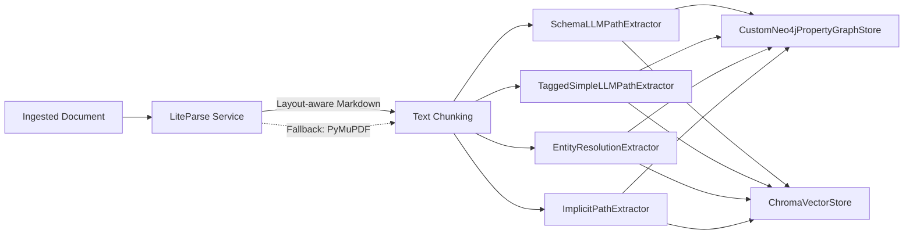
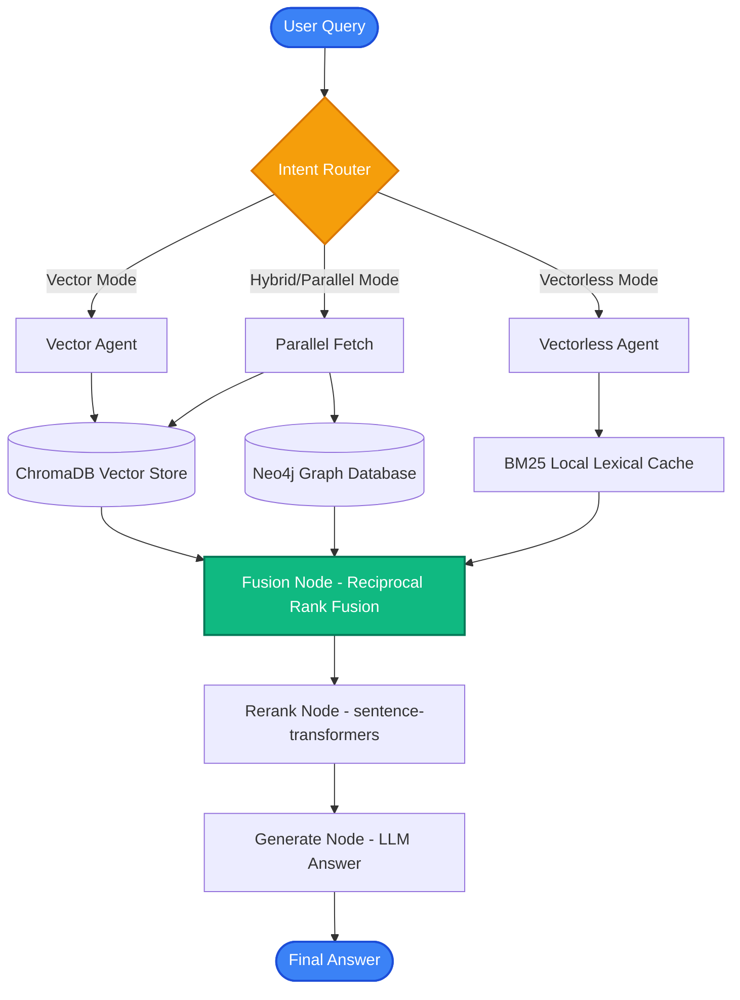

# KineticGraph-Vectra

<div align="center">

**A Production-Ready Hybrid RAG System**

*Combining Vector Search (ChromaDB) and Graph Reasoning (Neo4j) with LangGraph Orchestration*

[](https://fastapi.tiangolo.com)
[](https://www.python.org)
[](https://www.docker.com)
[](https://docs.ragas.io)

</div>

---

## 🎯 Overview

**KineticGraph-Vectra** is a lean, highly optimized hybrid RAG (Retrieval-Augmented Generation) system that coordinates searches across:

- **Vector Database (ChromaDB):** Fast semantic similarity search on document embeddings.
- **Graph Database (Neo4j):** Deep relational reasoning with entities and relationships.
- **Vectorless Search (BM25 Local Cache):** Ultra-fast lexical retrieval directly from disk.
- **Fusion Layer (RRF):** Reciprocal Rank Fusion to intelligently merge results from all active retrieval pathways.

The system uses **LangGraph** to orchestrate complex query workflows and **Celery** for asynchronous document processing.

---

## ✨ Codebase Highlights & Optimization

### 1. Kinetic-V v3 Context-Enriched Graph Nodes

Kinetic-V v3 closes a key grounding gap in the graph retrieval path: entity results now carry the source chunks needed to support and cite their claims. The additive v2 → v3 migration enriches existing Neo4j entities with:

- A concise `description` generated from existing graph evidence.
- Stable `parent_context_chunk_ids` linking graph entities to their source chunks.
- A compact JSON evidence snapshot for retrieval-time grounding while ChromaDB remains the authoritative store for embeddings and full vector content.
- Relationship evidence and graph-positioning fields (`community_id`, `centrality_score`, and `depth_from_root`).
- A `schema_version` marker so migrated nodes can be audited safely.

Neo4j cannot store nested maps as native properties, so context links and relationship evidence are serialized while stable chunk IDs remain directly queryable. Graph retrieval expands these persisted evidence chunks into the generation context with chunk IDs such as `[chunk_id]`, making answers easier to ground and cite.

The migration is additive and idempotent: it updates entities with existing `MENTIONS` links, reports entities without source context, and does not delete or re-embed data. See [`docs/v3_schema_audit.md`](docs/v3_schema_audit.md) for the schema-gap audit and design rationale.

### 2. Robust RAGAS Evaluation & Diagnostics
- **Live Failure Interception**: Updated [`RAGASEvaluator`](eval/ragas_evaluator.py) to catch evaluation failures, logging detailed warnings showing the exact query and the specific metrics that failed (e.g. returning `NaN` or raising exceptions) while falling back cleanly to keyword heuristics.
- **Concurrent Batch Eval**: Added `evaluate_live_workflow` and `evaluate_live_single` supporting concurrent, rate-limited live workflow evaluations asynchronously, resulting in faster and safer benchmark runs.
- **Model-Agnostic Critic Settings**: Configures separate evaluation LLMs (critic/judge) via the `critic_model` parameter, enabling stable benchmark tracking (e.g., using Claude Haiku) even while testing various generation engines.
- **OpenRouter Compatibility**: Detects OpenRouter environments and automatically configures base URLs accordingly, enabling direct usage of stable and extremely cheap paid OpenRouter endpoints (e.g., `gpt-4o-mini` or `meta-llama/llama-3.3-70b-instruct`) without hitting free-tier congestion or 429 rate-limiting.

### 3. "Ponytail" YAGNI Optimization
- **Purged Over-Engineering**: Cleaned up the repository by deleting speculative Kubernetes manifests, custom telemetry databases, Streamlit dashboard instances, and LangSmith tracing wrappers.
- **Pruned Dependencies & Vulnerabilities**: Removed unused heavy libraries (`streamlit`, `plotly`, `langsmith`, `psycopg2-binary`) from `requirements.txt` to minimize codebase bloat, dependency conflicts, and security vulnerability surface areas.
- **Ingestion Streamlining**: Replaced Celery's billiard-based parallel PDF text extraction pool with a fast, sequential PyMuPDF (fitz) iteration loop inside `document_processor.py`, eliminating process-forking overhead and file-locking bottlenecks.

### 4. Decoupled PropertyGraphIndex Dual-Store (Neo4j + ChromaDB)
KineticGraph-Vectra features a **state-of-the-art decoupled Graph RAG index** using LlamaIndex's `PropertyGraphIndex` but uniquely engineered to maintain **strict storage isolation** between the relational graph database (**Neo4j**) and the dense vector database (**ChromaDB**). 

Unlike default implementations that collapse both vectors and graph entities into Neo4j's native vector indices, this decoupled architecture guarantees:
- **Independent Scaling**: Scale your vector query capacity (ChromaDB memory/nodes) independently from your graph traversal complexity (Neo4j memory/CPU).
- **Vendor Lock-in Avoidance**: Swap out ChromaDB or Neo4j for other specialized engines without rebuilding the entire extraction or ingestion pipelines.
- **Granular Embedding Fusing**: Compute and store embeddings for chunks, entities, and relationship summaries, enabling precise Reciprocal Rank Fusion (RRF) at query time.

#### Ingestion Flow & Extractor Stack
Every ingested document goes through a pipeline of concurrent, specialized extractors aligned with a constrained ontology schema:



1. **`SchemaLLMPathExtractor`**: Constrains extraction to a strict YAML-defined ontology (e.g., `Component`, `Service`, `Command`, `Status`) and relations (e.g., `Uses`, `Implements`, `Minimizes`).
2. **`TaggedSimpleLLMPathExtractor`**: Serves as a high-recall fallback extractor to capture open-domain facts when schema constraints are too narrow.
3. **`EntityResolutionExtractor`**: Runs inline semantic deduplication (using exact token match and high-similarity Levenshtein/Rau-de-Smet clustering) to collapse alias nodes (e.g. `LangGraph` and `LangGraph orchestrator`) before write time.
4. **`ImplicitPathExtractor`**: Injects structural knowledge paths (e.g., `Chunk` nodes linked via `MENTIONS` to their extracted entities) to preserve local source context.

---

## 🏗️ Architecture

### System Components



```

```

### Infrastructure Stack

| Component | Technology | Purpose |
|-----------|------------|---------|
| **API Framework** | FastAPI | Asynchronous REST API |
| **Orchestration** | LangGraph | Intent routing, parallel retrieval, rerank, generate |
| **Vector DB** | ChromaDB | Semantic search |
| **Graph DB** | Neo4j | Entity relationships |
| **Task Queue** | Celery + Redis | Async document processing |
| **Document Parser** | LiteParse (self-hosted) | Layout-aware PDF → Markdown (tables, multi-column) |
| **Containerization** | Docker Compose | Local deployment and testing |
| **Evaluation** | RAGAS | Offline/live evaluation (faithfulness, relevancy, recall, correctness) |

### 📄 LiteParse — Local Document Parsing Service

KineticGraph-Vectra uses a **self-hosted [LiteParse](https://github.com/run-llama/liteparse-server) container** as its primary PDF extraction engine. Unlike traditional text-extraction libraries (PyMuPDF, pypdf) that flatten multi-column layouts and drop table formatting, LiteParse uses PDFium coordinate-aware layout analysis and embedded OCR to produce clean, structure-preserving **Markdown**.

**Why this matters for GraphRAG:**
- **Table Context Isolation:** Tables output as `| Entity | Relation | Entity |` syntax — column values map directly to their header semantic bounds during entity extraction.
- **Multi-column Rectification:** Absolute bounding-box tracing prevents unrelated paragraphs from being joined across columns.
- **Zero Data Egress:** Processing runs entirely within the local Docker network — no cloud API calls, no per-page costs.

**Resilient Fallback:** If the LiteParse container is unavailable, `extract_text_from_pdf` silently falls back to PyMuPDF and logs a warning — ingestion never hard-fails due to parser availability.

```
[ Local PDF ] ──► [ LiteParse Container :5707 ] ──► [ Structured Markdown ]
                           │ (unavailable)
                           └──► [ PyMuPDF fallback ] ──► [ Plain text ]
```

**Key files:**
- [`backend/graph_ingestion/lite_parser.py`](backend/graph_ingestion/lite_parser.py) — `LiteParseClient` HTTP wrapper
- [`backend/workers/document_processor.py`](backend/workers/document_processor.py) — `extract_text_from_pdf` with LiteParse-first strategy
- [`infra/docker-compose.yml`](infra/docker-compose.yml) — `liteparse` service definition

---

## 🚀 Quick Start

### Prerequisites

- **Docker** and **Docker Compose**
- **OpenAI API Key**

### 1. Clone and Setup

```bash
# Clone the repository and copy environment template
cp .env.example .env

# Edit .env and add your OpenAI API key
# PARSER_URL is pre-configured to http://liteparse:5707 inside Docker
# For local dev outside Docker, set PARSER_URL=http://localhost:5707
nano .env
```

### 2. Start Services

```bash
# Build and start all services via Docker Compose (resides in infra/)
cd infra
docker compose up --build -d
```

### 3. Verify Health

| Service | URL | Notes |
|---------|-----|-------|
| **Swagger UI** | http://localhost:8000/docs | FastAPI API docs |
| **Neo4j Browser** | http://localhost:7474 | user: `neo4j`, password: see `.env` |
| **ChromaDB API** | http://localhost:8001 | Heartbeat: `/api/v1/heartbeat` |
| **LiteParse** | http://localhost:5707 | Liveness: `POST /parse` → `400` = alive |
| **Chat UI** | http://localhost:8080 | Start via `cd frontend && python3 serve.py` |

```bash
# Quick LiteParse liveness check
curl -s -o /dev/null -w "LiteParse: %{http_code}\n" -X POST http://localhost:5707/parse
# Expected: LiteParse: 400
```

### 4. Enrich Existing Graph Nodes for v3

After upgrading an existing v2 deployment, preview the migration before applying it:

```bash
# Report migration candidates without changing Neo4j
PYTHONPATH=. python scripts/enrich_kinetic_v_nodes.py --dry-run --batch-size 200

# Apply the additive v3 enrichment
PYTHONPATH=. python scripts/enrich_kinetic_v_nodes.py
```

Example result:

```text
{'enriched': 128, 'skipped_without_verified_context': 7, 'scanned': 135, 'verified_vector_links': 384, 'missing_vector_links': 7, 'complete': False}
```

New ingestion remains idempotent across both `Chunk` and legacy `__Chunk__` Neo4j labels and runs enrichment automatically. Links missing from ChromaDB—or present without an embedding—are rejected and counted. Existing entities without verified source chunks are deliberately skipped so the migration never invents supporting evidence.

---

## 📚 Usage

### Document Ingestion

```bash
curl -X POST "http://localhost:8000/api/v1/ingest/document" \
  -H "Content-Type: multipart/form-data" \
  -F "file=@/path/to/document.pdf"
```

### Querying the System (Hybrid Search)

```bash
curl -X POST "http://localhost:8000/api/v1/query" \
  -H "Content-Type: application/json" \
  -d '{
    "query": "What are the main findings about Reciprocal Rank Fusion?",
    "mode": "hybrid",
    "max_results": 5
  }'
```

---

## 🔬 Evaluation & Diagnostics

The evaluation layer is built around [RAGAS](https://docs.ragas.io) to monitor system performance offline and live.

- **Synthetic Testset Generation**: Create rich multi-hop and specific factual benchmark questions directly from the project's documentation using:
  ```bash
  python scripts/generate_testset.py --size 5 --output eval/kinegraph_benchmark_v1.csv
  ```
- **Direct Database Ingestion**: Populate ChromaDB and Neo4j locally with documentation:
  ```bash
  python scripts/ingest_docs.py
  ```
- **Live Pipeline Benchmarking**: Execute the live RAG pipeline on your benchmark questions and compute RAGAS metrics:
  ```bash
  python scratch/run_evaluation.py
  ```
- **Live Diagnostics**: [`RAGASEvaluator`](eval/ragas_evaluator.py) automatically catches evaluation errors/NaN scores and warns on the console with the exact query and failed metrics details, falling back cleanly to keyword heuristics.
- **Concurrent Batch Eval**: Supports asynchronous concurrent live evaluation of the RAG workflow via the `evaluate_live_workflow` method.

The v3 benchmark targets are **Faithfulness ≥ 0.75**, **Answer Relevancy ≥ 0.65**, and **Context Recall ≥ 0.65**. The scores below are the latest recorded pre-v3/composed baseline; rerun the live benchmark after migrating production data to measure progress against those targets.

#### Baseline Evaluation Scores

| Metric | Baseline Score | Composed Graph Score | Status / Recommendation |
| :--- | :---: | :---: | :--- |
| **Faithfulness** | 0.3292 | **0.6000** | Fraction of answer claims supported by retrieved context. |
| **Answer Relevancy** | 0.1016 | **0.5659** | How well the answer addresses the question. |
| **Context Precision** | 1.0000 | **0.4500** | Signal-to-noise: most relevant chunks ranked first. |
| **Context Recall** | 0.3476 | **0.6000** | Fraction of ground-truth info present in context. |
| **Answer Correctness** | 0.3745 | **0.4082** | Answer accuracy vs reference ground truth. |
| **Overall Composite** | **0.4306** | **0.5248** | Overall composite score over benchmark dataset. |

#### RAGAS Evaluation Radar Chart


---

## 🛠️ Local Development

```bash
# Create and activate virtual environment
python -m venv venv
source venv/bin/activate

# Install dependencies
pip install -r requirements.txt

# Run FastAPI app locally
uvicorn backend.app.main:app --reload --port 8000

# Run Celery worker
celery -A backend.workers.celery_app worker --loglevel=info

# Run the v3 enrichment and retrieval regression tests
PYTHONPATH=. pytest -q tests/test_enrichment.py tests/test_retrievers.py tests/test_ingest_idempotency.py tests/test_stores.py
```

---

**Built with ❤️ for lean, highly performant hybrid RAG systems**
