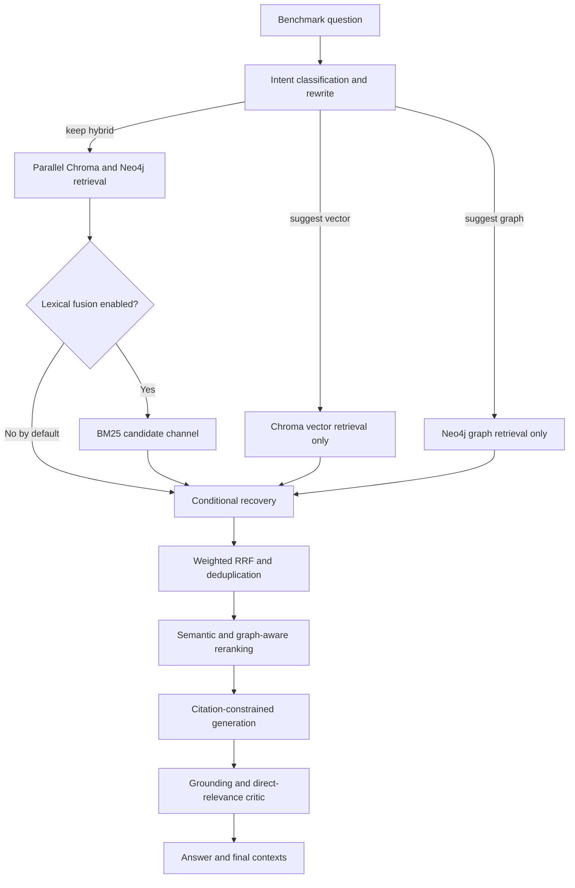
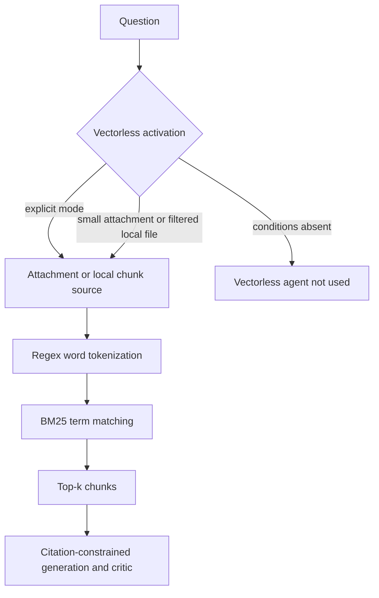

# Kinegraph Metric Root-Cause Analysis

## Purpose and evidence standard

This report explains why Kinegraph's persisted pre-v3 RAGAS results are low and
which failure categories the current Hybrid and Vectorless architectures can
produce. It uses only checked-in artifacts and deterministic code inspection;
no Neo4j, ChromaDB, BM25, generation-model, or RAGAS judge call was made.

Every causal finding uses one of these labels:

- **Confirmed** — demonstrated directly by checked-in code, Git history, or a
  deterministic classifier reproduction.
- **Strong inference** — supported by the relationship between the aggregate
  metrics, benchmark structure, and implemented data flow, but not by a saved
  per-query trace.
- **Unverified** — plausible, but requires a new instrumented live evaluation.

The persisted report contains aggregate scores only. It does not contain a
per-query answer, effective route, channel candidates, discarded chunks,
citations, critic decision, or judge rationale. Consequently, this document
does **not** claim a measured post-v3 improvement or assign an observed score to
an individual query.

## Executive diagnosis

The recorded results are:

| Metric | Persisted score | Evidence-based interpretation |
|---|---:|---|
| Context precision | 1.0000 | **Strong inference:** retrieved context was narrow and relevant when present; retrieval noise is not the primary signal in this aggregate. |
| Context recall | 0.3476 | **Strong inference:** the dominant retrieval symptom is missing reference facts or question facets. |
| Faithfulness | 0.3292 | **Strong inference:** an evidence deficit can leave generation without enough retrieved support, but unsupported per-query claims were not persisted. |
| Answer relevancy | 0.1016 | **Unverified:** this may reflect off-topic, incomplete, empty, or judge-misaligned answers; the saved report lacks answers and rationales needed to distinguish them. |
| Answer correctness | 0.3745 | **Strong inference:** incomplete context and potentially stale references can both reduce reference agreement. Their individual contributions are unknown. |

**Strong inference:** precision `1.0000` together with recall `0.3476` is the
signature of a coverage problem, not primarily an over-retrieval problem. The
first remediation target should therefore be route and facet coverage; reducing
top-k further would risk worsening recall.

**Confirmed:** the score artifact and the current benchmark are not from the
same repository state. Git history records
`reports/evaluation_report.md` at commit `63f7de1` on 2026-06-28, while the
20-row benchmark was expanded and updated at commits `a495adb` and `c77615a` on
2026-07-19 and 2026-07-20. The report therefore cannot describe the current
20-query dataset or the current v3 workflow.

## Causal trees

### Hybrid path



| Failure point | Evidence | Causal effect |
|---|---|---|
| Intent routing changes a requested Hybrid run into Vector-only or Graph-only | **Confirmed:** the router replaces `HYBRID` when the classifier suggests `vector` or `graph` ([workflow](../backend/core/langgraph_workflow.py#L338-L346)). | A necessary retrieval channel can be absent before fusion, lowering context recall for compound or misclassified questions. |
| Query rewriting adds generic intent vocabulary | **Confirmed:** the rewriter prepends phrases such as `process steps mechanism workflow` and `concept overview purpose` ([classifier](../backend/core/intent_classifier.py#L100-L111)). | **Unverified:** the expansion may dilute exact identifiers or improve dense recall; per-query candidate logs are required to measure the direction. |
| Lexical retrieval is absent by default | **Confirmed:** both workflow and evaluator default `enable_lexical_fusion=False` ([workflow](../backend/core/langgraph_workflow.py#L925-L940), [evaluator](../eval/ragas_evaluator.py#L388-L413)). | Exact URLs, filenames, environment variables, commands, and numerical limits receive no BM25 channel unless explicitly enabled. |
| Conditional recovery runs only after an initial weakness assessment | **Confirmed:** recovery exits when disabled, Vectorless is active, or the initial assessment is not weak ([workflow](../backend/core/langgraph_workflow.py#L539-L567)). | **Unverified:** a false-negative weakness assessment can leave a multi-facet query without decomposition. |
| RRF favors rank evidence across active channels | **Confirmed:** active Vector, Graph, and optional lexical lists are passed to weighted RRF before deduplication ([workflow](../backend/core/langgraph_workflow.py#L681-L706)). | **Unverified:** a uniquely relevant chunk from one channel may rank below overlapping but incomplete chunks; saved pre-fusion rankings are required to prove a case. |
| Default reranking is not a cross-encoder | **Confirmed:** `HybridRAGWorkflow` initializes `ContextRanker` with `use_cross_encoder=False` ([workflow](../backend/core/langgraph_workflow.py#L224-L238)); keyword mode splits lowercase text on whitespace ([ranker](../backend/core/context_ranker.py#L37-L48)). | Identifiers, punctuation-heavy commands, URLs, and misspellings can receive weak lexical overlap and be removed or reordered. |
| Strict generation can trade coverage for grounding | **Confirmed:** every generated claim must cite retrieved chunk IDs, and the critic can remove claims that are unsupported or not directly relevant ([workflow](../backend/core/langgraph_workflow.py#L43-L92), [workflow](../backend/core/langgraph_workflow.py#L808-L882)). | **Strong inference:** when retrieval misses a required facet, the safe response can be incomplete or empty, protecting faithfulness while reducing relevancy and correctness. |

### Vectorless path



| Failure point | Evidence | Causal effect |
|---|---|---|
| The persisted evaluation does not test the dedicated Vectorless route | **Confirmed:** the CLI passes `QueryMode.HYBRID` ([evaluator](../eval/ragas_evaluator.py#L767-L779)) and supplies neither attachment content nor file filters. The router activates Vectorless only for an explicit mode, suitable attachment, or matching filtered local file ([workflow](../backend/core/langgraph_workflow.py#L353-L377)). | No persisted metric can be attributed to the dedicated Vectorless agent. |
| Optional lexical fusion is not equivalent to Vectorless mode | **Confirmed:** Hybrid may add BM25 as a third candidate list ([workflow](../backend/core/langgraph_workflow.py#L418-L428)), whereas Vectorless mode bypasses Vector/Graph retrieval and places BM25 results in the single-mode path ([workflow](../backend/core/langgraph_workflow.py#L490-L530)). | Hybrid+lexical and dedicated Vectorless require separate benchmark slices and must not share one label. |
| BM25 requires exact lexical evidence | **Confirmed:** Vectorless tokenizes with `\w+` and scores only query tokens present in a document ([vectorless service](../backend/services/vectorless_service.py#L41-L103)). | Misspellings such as `documnt` and `opne` can reduce recall unless the correctly spelled surrounding terms identify the same chunk. |
| Small attachments are returned as one full chunk | **Confirmed:** attachment content under 15,000 characters is returned as a single result ([vectorless service](../backend/services/vectorless_service.py#L218-L240)). | **Unverified:** this can maximize small-document recall but reduce context precision when the question targets one narrow passage. |

## Confirmed routing failure cases

The table below was reproduced by passing the checked-in 20 questions through
`classify_intent()` without databases or model calls.

| Query | Reproduced route | Failure category | Expected metric pressure |
|---:|---|---|---|
| 1 — LangGraph advantages compared with vector-only or graph-only | `definition → vector` | **Confirmed:** `what are` and `compare` tie; intent insertion order selects `definition`. A comparison question loses Graph retrieval. | Context recall, answer correctness |
| 6 — ChromaDB concurrent retrieval across multiple databases | `factual_lookup → graph` | **Confirmed:** wording matches a factual trigger and routes a ChromaDB/async-workflow question to Graph-only. | Context recall, answer relevancy |
| 11 — `OPENAI_API_KEY` formatting and security practices | `definition → vector` | **Confirmed:** a compound exact-token/procedural question is handled as a definition and receives no default BM25 channel. | Context recall, answer correctness |
| 13 — upload through an exact localhost API URL | `definition → vector` | **Confirmed:** the procedural URL query routes to Vector-only and receives no default BM25 channel. | Context recall, answer correctness |
| 14 — ingest `test.pdf` and report processing status | `definition → vector` | **Confirmed:** competing definition/how-to triggers select definition; the benchmark reference contains two facets. | Context recall, answer correctness |
| 15 — open the Neo4j Browser URL with `opne` misspelled | `how_to → hybrid` | **Confirmed:** Hybrid runs, but lexical fusion is disabled by default, removing the modality best suited to exact URL matching. | Context recall, answer relevancy |

Query 12 is **not** a confirmed routing failure. The current classifier returns
`comparison → hybrid`; this corrects the earlier planning hypothesis that it
would select `definition → vector`.

## Benchmark taxonomy

Definitions used below:

- `single` and `multi` come from the checked-in RAGAS synthesizer name.
- `exact` means the query includes a filename, URL, environment variable, or
  explicit resource/value syntax that lexical retrieval can preserve.
- `compound` means the question asks for multiple facets or a comparison.
- `misspelled` includes the benchmark's misspelling style and explicit
  `documnt`/`opne` cases.
- `2-ref` means `reference_contexts` explicitly contains a `<2-hop>` passage.

| # | Synthesized | Exact | Compound | Misspelled | 2-ref | Reproduced intent → mode |
|---:|:---:|:---:|:---:|:---:|:---:|---|
| 1 | single | — | ✓ | ✓ | — | definition → vector |
| 2 | single | — | — | — | — | how_to → hybrid |
| 3 | single | — | ✓ | — | — | how_to → hybrid |
| 4 | single | — | ✓ | — | — | debugging → hybrid |
| 5 | single | — | ✓ | — | — | how_to → hybrid |
| 6 | single | — | — | — | — | factual_lookup → graph |
| 7 | single | — | — | — | — | definition → vector |
| 8 | single | — | — | — | — | conceptual → hybrid |
| 9 | multi | — | ✓ | — | ✓ | how_to → hybrid |
| 10 | multi | ✓ | ✓ | ✓ | — | how_to → hybrid |
| 11 | multi | ✓ | ✓ | — | — | definition → vector |
| 12 | multi | — | ✓ | — | — | comparison → hybrid |
| 13 | multi | ✓ | — | — | — | definition → vector |
| 14 | multi | ✓ | ✓ | — | ✓ | definition → vector |
| 15 | multi | ✓ | — | ✓ | — | how_to → hybrid |
| 16 | multi | — | ✓ | — | — | how_to → hybrid |
| 17 | multi | — | ✓ | — | ✓ | how_to → hybrid |
| 18 | multi | — | ✓ | — | ✓ | how_to → hybrid |
| 19 | multi | — | ✓ | — | ✓ | conceptual → hybrid |
| 20 | multi | — | — | — | ✓ | how_to → hybrid |

**Confirmed:** the dataset contains 8 single-hop and 12 multi-hop questions,
5 exact-token questions, 13 compound questions, 3 misspelled questions, and 6
questions whose reference explicitly includes a second-hop passage.

**Strong inference:** one aggregate score across these categories hides
systematic mode-specific failures. In particular, the dataset does not provide
a clean Vectorless slice, and compound/multi-hop coverage cannot be diagnosed
from a single mean.

## Root-cause catalogue

| Root cause | Status | Evidence and impact |
|---|---|---|
| Stale score provenance | **Confirmed** | The report predates the current dataset and v3 workflow. It is unsuitable for current architecture attribution. |
| Vectorless not evaluated | **Confirmed** | The evaluator runs Hybrid and does not supply Vectorless activation inputs. No Vectorless precision or recall result exists. |
| Silent mode downgrade | **Confirmed** | Hybrid requests may become Vector-only or Graph-only; queries 1, 6, 11, 13, and 14 demonstrate potentially lossy classifications. |
| Multi-facet coverage deficit | **Strong inference** | Six references explicitly require a second passage, while aggregate context recall is only `0.3476`. Per-query contexts are unavailable. |
| Exact-term modality gap | **Strong inference** | Five questions carry exact identifiers, but the benchmark disables lexical fusion. Candidate-level misses are not saved. |
| RRF suppression of unique evidence | **Unverified** | The mechanism can occur, but no pre/post-fusion candidate lists exist in the persisted evidence. |
| Weak default lexical reranking | **Confirmed mechanism; unverified occurrence** | Keyword reranking is the default and is fragile for identifiers/misspellings, but discarded chunks were not persisted. |
| Strict synthesis after incomplete retrieval | **Confirmed mechanism; strong inferred impact** | Citation and critic gates remove unsupported content; missing facets can therefore become incomplete answers. |
| Reference quality mismatch | **Confirmed risk; unverified score contribution** | The benchmark mixes `KineticGraph-Vectra` and `kinegraph-v`, historical operational instructions, and generated claims. No human reference audit or judge rationale is stored. |
| Missing diagnostic provenance | **Confirmed** | The concurrent evaluator uses final contexts for judging but persists only their count; it also discards effective mode, per-channel lists, reranker drops, citation validation, critic output, and route rationale ([evaluator](../eval/ragas_evaluator.py#L486-L549)). |

## Metric-to-stage matrix

Legend: `D` = direct influence, `C` = downstream/cascading influence, `—` = no
material direct relationship expected.

| Pipeline stage | Faithfulness | Answer relevancy | Context precision | Context recall | Answer correctness |
|---|:---:|:---:|:---:|:---:|:---:|
| Intent routing and rewriting | C | C | D | D | C |
| Vector/Graph/BM25 candidate retrieval | C | C | D | D | C |
| Conditional decomposition/recovery | C | C | D | D | C |
| RRF and deduplication | C | C | D | D | C |
| Reranking and top-k truncation | C | C | D | D | C |
| Citation-constrained generation | D | D | — | — | D |
| Grounding/relevance critic | D | D | — | — | D |
| Reference and judge quality | D | D | D | D | D |

**Strong inference:** context recall is the most important upstream constraint
in the persisted pattern. Faithfulness, relevancy, and correctness cannot fully
recover facts that never reach generation, while aggressive filtering can make
the final answer safer but incomplete.

## Prioritized remediation

1. **Correct provenance and expose effective routing.** Persist dataset hash,
   Git revision, requested mode, effective mode, intent scores, rewritten query,
   recovery decision, and judge rationale for every row. Treat the current
   aggregate as historical only.
2. **Create explicit mode slices.** Run the same eligible questions separately
   through Hybrid-without-lexical, Hybrid-with-lexical, and dedicated
   Vectorless. Do not describe optional lexical fusion as Vectorless mode.
3. **Fix compound and multi-facet routing.** Replace first-winner intent ties
   with multi-label/facet-aware routing; queries 1, 6, 11, 13, and 14 become
   regression cases. Persist coverage for each requested facet.
4. **Test retrieval levers one at a time.** First compare lexical fusion off/on
   for exact-token questions, then keyword/cross-encoder reranking, then graph
   hop depth. Use the controlled benchmark manifest and regression guardrails in
   [EXPERIMENT_VALIDATION.md](EXPERIMENT_VALIDATION.md).
5. **Audit benchmark references before pipeline tuning.** Human-review current
   names, endpoints, commands, numerical limits, and technical assertions.
   Version the accepted reference set and keep it frozen during comparisons.

## What an instrumented run must add

The following evidence is required to convert **Strong inference** or
**Unverified** findings into confirmed failures:

- requested and effective retrieval mode;
- classifier scores and route rationale;
- rewritten query and recovery subqueries;
- ranked Vector, Graph, and BM25 candidate IDs with scores;
- RRF contributions, deduplication removals, reranker scores, and top-k drops;
- final chunk IDs and reference-facet coverage;
- generated atomic claims, citations, validation removals, and critic reasons;
- per-query RAGAS metrics, judge model, judge rationale, and failure provenance.

Until those fields are persisted, there is no evidence-backed per-query failure
score and no measured Vectorless performance result in this repository.

## Reproduction notes

The routing table was generated without databases:

```bash
PYTHONPATH=. python - <<'PY'
import csv
from backend.core.intent_classifier import classify_intent

with open("eval/kinegraph_benchmark_v1.csv", newline="") as handle:
    for index, row in enumerate(csv.DictReader(handle), 1):
        result = classify_intent(row["user_input"])
        print(index, result["intent"], result["suggested_mode"], row["user_input"])
PY
```

The artifact dates were verified with:

```bash
git log --follow --format='%h %ad %s' --date=short -- reports/evaluation_report.md
git log --follow --format='%h %ad %s' --date=short -- eval/kinegraph_benchmark_v1.csv
```
