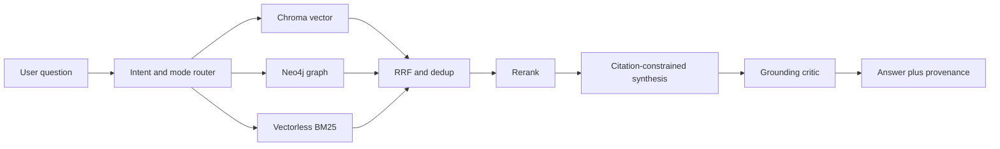
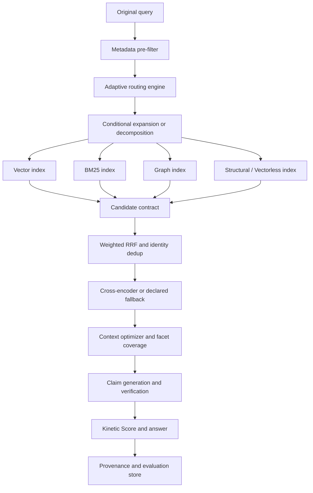
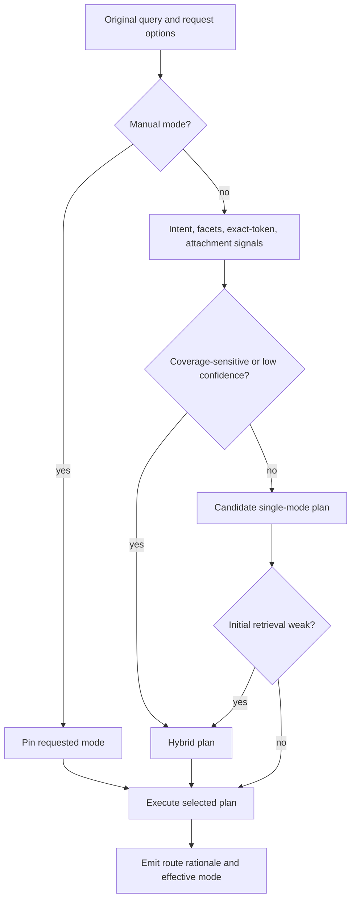
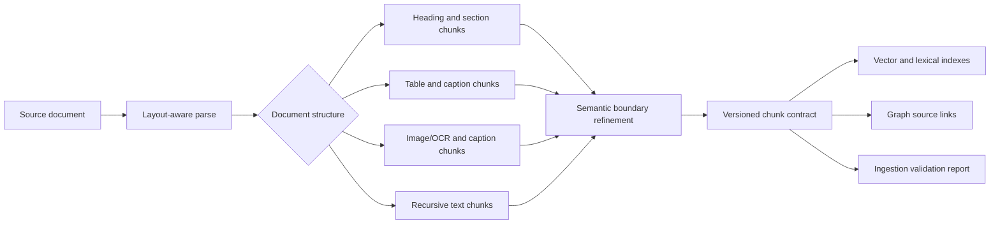
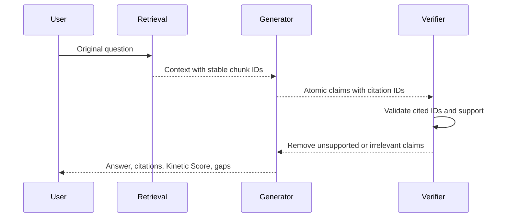
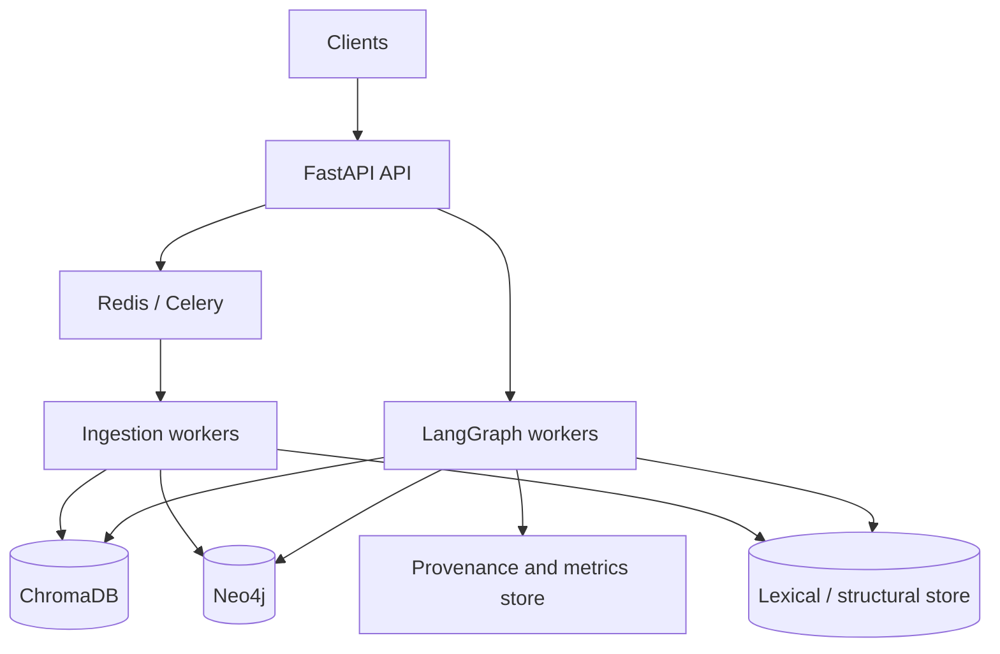

# Kinetic-V 2.0 Architectural Improvement Plan

- **Status:** Proposed
- **Owner:** Kinetic-V maintainers
- **Decision horizon:** Kinetic-V 2.0
- **Related:** [Architecture Principles](../ARCHITECTURE_PRINCIPLES.md), [Metric Root-Cause Analysis](../METRIC_ROOT_CAUSE_ANALYSIS.md), [Roadmap](ROADMAP.md)

## Executive summary

Kinetic-V 2.0 evolves Kinegraph from a collection of retrieval capabilities into
an evidence-first retrieval platform with explicit decisions, confidence, and
verification at every boundary. It does not replace the current Vector, Graph,
Hybrid, or Vectorless paths. It makes their selection, retrieval quality, and
answer trustworthiness observable and comparable.

> Retrieve verified evidence first. Explain how it was found. Generate only what the evidence supports.

The persisted benchmark evidence is pre-v3 and is not proof of 2.0 improvement.
Its high recorded precision with low recall suggests a coverage problem, not a
reason to indiscriminately increase retrieval breadth. Therefore 2.0 prioritizes
explicit routing, facet coverage, provenance, and controlled experiments before
introducing expensive or speculative mechanisms.

## Scope and non-goals

**In scope**

- Adaptive but reversible routing across Vector, Graph, Hybrid, Hybrid+BM25, and Vectorless paths.
- Format-aware, provenance-preserving chunking.
- Multi-index retrieval, confidence, claim verification, and benchmark governance.
- Deployment, scale, security, and an implementation sequence.

**Out of scope**

- Replacing ChromaDB, Neo4j, LangGraph, FastAPI, or Celery without measured need.
- Treating generated hypotheses as evidence.
- Promoting HyDE, decomposition, a new reranker, or deeper traversal without an accepted benchmark manifest.
- Claiming metric gains before a live, provenance-complete RAGAS run succeeds.

## Current architecture assessment

Kinetic-V currently uses layout-aware LiteParse with a PyMuPDF fallback, chunk
embeddings in ChromaDB, evidence-linked entities and relationships in Neo4j,
Celery ingestion, and LangGraph query orchestration. The retrieval workflow can
use Vector, Graph, Hybrid, and Vectorless retrieval; active results are
recovered conditionally, fused with weighted RRF, deduplicated, reranked, and
passed through citation-constrained generation and a grounding critic.

### Pain points and responses

| Area | Current risk | 2.0 response |
|---|---|---|
| PDF ingestion | Fixed recursive chunks can lose document structure. | Add structural, semantic, recursive, table, and image chunk policies behind a versioned contract. |
| Routing | Compound Hybrid queries can be downgraded to one channel. | Preserve manual mode, score route suitability, and require coverage checks before downgrade. |
| Retrieval | RRF rewards rank agreement but cannot prove completeness. | Preserve channel evidence, use explicit coverage signals, and rerank after fusion. |
| Graph RAG | Extra hops can dilute evidence. | Bounded, path-returning traversal with depth experiments and community constraints. |
| Trust | Individual scores do not explain answer trust. | Compute a transparent Kinetic Score from observable signals. |
| Evaluation | Aggregate metrics cannot identify the failing stage. | Persist per-query provenance, benchmark slices, references, and judge outcomes. |

## Vision and binding principles

Kinetic-V should answer with the smallest sufficient set of verified evidence,
show the route used to find it, and expose uncertainty. The existing
Architecture Principles govern this proposal:

1. Source chunks, not model output, are the authority.
2. The original query remains authoritative after rewrites or decomposition.
3. Prefer the simplest retrieval path that covers the question.
4. Use recovery only when observable weakness is present, before RRF.
5. Graph traversal is bounded, directional, and evidence-bearing.
6. Fusion combines candidates; it never validates them.
7. Relevance to the literal question outranks graph popularity.
8. Faithfulness outranks plausible completeness.
9. Every feature is observable, configurable, benchmarked, and reversible.

## Target reference architecture

All arrows carry stable identifiers, source channel, configuration revision, and
stage latency. No stage may convert an unverified generated statement into a
source candidate.

## Adaptive Routing Engine

The router chooses an execution plan, not an answer. It first honors an explicit
caller mode. Automatic routing can select or retain a route only with recorded
signals and a rollback path.

| Query characteristic | Preferred route | Guardrail |
|---|---|---|
| Conceptual single-facet question | Vector | Retain Hybrid if classifier confidence is low. |
| Named entities, dependencies, relationship question | Graph or Hybrid | Require a verified graph seed and evidence-bearing path. |
| Compound, comparison, or multi-hop question | Hybrid | Do not downgrade until facet coverage is demonstrated. |
| Exact command, URL, filename, identifier | Hybrid+BM25 | Lexical channel remains an experiment until acceptance gate passes. |
| Direct small attachment or explicit local-document request | Vectorless | Return document provenance and bound context size. |
| Low-confidence route | Hybrid | Record uncertainty; do not silently choose a single mode. |

The router persists requested mode, effective mode, confidence, signals,
rejected alternatives, and any downgrade reason. A route experiment becomes
default only after benchmark slice acceptance.

## Adaptive Chunking Engine

The ingestion contract produces source-faithful chunks, stable identifiers, and
structural metadata. A document is not fully ingested until its chunks are in
the Vector index, referenced from graph entities where applicable, and verified
by exact ID.

| Type | Use | Required metadata |
|---|---|---|
| Structural | Headings, paragraphs, lists, code blocks | document ID, section path, ordinal, page range |
| Semantic | Coherent prose with safe boundary refinement | parent structural ID, boundary reason |
| Recursive | Fallback for unstructured text | tokenizer/version, overlap, ordinal |
| Table | Table cells plus headers, caption, and page | table ID, headers, caption, coordinates |
| Image | OCR text and caption, never invented description | image ID, page, extraction method, confidence |

Chunk IDs use SHA-256-derived stable identifiers. Chunking policy and parser
version are immutable metadata so benchmark results can be reproduced across
ingestion versions.

## Multi-index architecture

| Index | Ownership | Purpose | Not responsible for |
|---|---|---|---|
| Vector | ChromaDB | Semantic candidate recall | Graph topology or source-of-truth relationships |
| BM25 | Lexical service / Vectorless corpus | Exact terms, commands, URLs, identifiers | Semantic equivalence |
| Graph | Neo4j | Entities, relationships, topology, bounded traversal | Embedding ownership |
| Structural | Document/chunk store | Section, table, image, and page locality | Semantic ranking alone |
| Metadata | Filterable chunk/document attributes | tenant, document, date, type, access controls | Relevance scoring alone |

Every candidate carries a stable ID, source channels, verbatim content,
document metadata, source-specific scores, graph path, and a provenance version.

## Multi-stage retrieval pipeline

1. **Metadata pre-filter:** apply access, tenant, document, and user filters before retrieval.
2. **Query understanding:** classify facets, entities, exact tokens, and attachment eligibility; retain the original query.
3. **Conditional recovery:** expand vocabulary, decompose, or run constrained HyDE only after weakness signals and only as an experiment.
4. **Channel retrieval:** retrieve wide from eligible indexes with per-channel limits.
5. **Fusion:** use weighted RRF with stable-identity deduplication and preserve source scores.
6. **Reranking:** rank against the original question; use graph signals as bounded secondary evidence.
7. **Context optimization:** select a diverse, non-duplicated, facet-covering evidence set.
8. **Verification:** generate cited atomic claims, validate citations, critique only for deletion or hedging, and return a transparent confidence result.

### Graph RAG strategy

Graph retrieval starts from verified entity seeds. It uses BFS by default with a
configurable hop ceiling, prevents cycles, preserves direction and edge evidence,
and returns complete paths. Community-restricted traversal is a noise-control
option, not a relevance substitute. A failed traversal retains non-graph
candidates and reports the channel failure.

## Retrieval Confidence Engine and Kinetic Score

The **Kinetic Score** is a 0–100 calibrated confidence indicator displayed with
an answer. It is not a claim of correctness and must never override a refusal.
It is an observable composite stored with its inputs and policy version.

| Weight | Component | Observable basis |
|---:|---|---|
| 30% | Evidence coverage | Required query facets supported by cited chunks |
| 20% | Verification success | Valid citation IDs and surviving claim checks |
| 15% | Retrieval relevance | Calibrated post-rerank scores, not LLM self-rating |
| 15% | Reranker confidence | Normalized model score or declared fallback confidence |
| 10% | Source diversity | Independent documents/channels where appropriate |
| 10% | Consistency | Verified graph-vector links and metadata agreement |

Conflict and missing-facet penalties apply after the weighted sum. Suggested
bands are 80–100 supported, 60–79 partially supported, 30–59 weak evidence,
and 0–29 refuse or request clarification. These thresholds are provisional and
require calibration against versioned evaluation data.

## Verification framework

- Every atomic claim cites chunk IDs actually sent to synthesis.
- Unknown citation IDs are rejected before return.
- The critic may remove, hedge, or identify a claim; it may not add facts or citations.
- Missing facets result in a partial answer with explicit gaps.
- No evidence, conflicting evidence, or failed validation triggers an evidence-unavailable response.

## Evaluation framework

Every run records the dataset hash, Git revision, configuration, models,
effective route, candidates, discarded candidates, graph paths, citations,
verification result, latency, cost, and RAGAS failure state.

| Layer | Measures |
|---|---|
| Retrieval | Precision@K, Recall@K, nDCG, source diversity, facet coverage |
| Generation | Faithfulness, answer relevancy, correctness, citation validity |
| Safety | Hallucination rate, unsupported claim rate, refusal precision |
| Operations | p50/p95 latency, throughput, cost/query, failure rate |
| Decision quality | Route accuracy, recovery trigger precision, Kinetic Score calibration |

Spider graphs summarize accepted benchmark runs only and link to immutable run
manifests. Aggregate charts must never conceal a degraded slice.

## Production deployment, scale, and security

Docker Compose remains the local reference deployment. Kubernetes is a later
option only when scale requires independent autoscaling, resource limits,
network policies, backups, and rolling migration controls. Stateful stores need
tested backup and restore procedures before horizontal scale is considered.

- Enforce tenant/document authorization in metadata filtering before retrieval.
- Treat generated Cypher as untrusted; validate bounded read-only queries and parameterize limits.
- Keep secrets out of source control; sanitize uploads and use server-generated storage names.
- Minimize and redact retained provenance where required.
- Apply least privilege to Neo4j, ChromaDB, Redis, workers, and metrics stores.

## Risks, mitigation, and acceptance

| Risk | Mitigation |
|---|---|
| Feature drift into an opaque agent | Require stage contracts, provenance, and architecture-gate acceptance. |
| Higher recall lowers precision | Retrieve wide, rerank, deduplicate, optimize context, and enforce slice-level regression limits. |
| HyDE introduces off-track hypotheses | Keep it opt-in, vector-only, post-weakness, labeled, and excluded from graph seeding. |
| Graph traversal noise | Bound hops, preserve path evidence, test depth by slice, and retain fallback candidates. |
| Kinetic Score is misread as truth | Label it evidence confidence, expose components, calibrate, and allow refusal. |
| Parser migrations break links | Use additive, idempotent migrations with exact-ID verification and policy versions. |

Implementation is governed by [ROADMAP.md](ROADMAP.md). Before a phase becomes
default, identify the measured failure and slice, define flags and rollback,
persist provenance, compare against a frozen audited benchmark with one changed
lever, and meet quality targets without unacceptable precision, latency, cost,
or explainability regression.

The target thresholds remain Faithfulness ≥ 0.75, Answer Relevancy ≥ 0.65,
Context Recall ≥ 0.65, Answer Correctness ≥ 0.60, and Context Precision ≥ 0.90.
No proposal or local demonstration constitutes achievement of those targets.

## Future research

- Calibrated Kinetic Score models and abstention thresholds.
- Decomposition that proves facet coverage without redundant calls.
- Domain-aware structural chunkers and multimodal table/image grounding.
- Learned fusion only if it remains explainable and reproducible.
- Graph community policies with measurable retrieval value.
